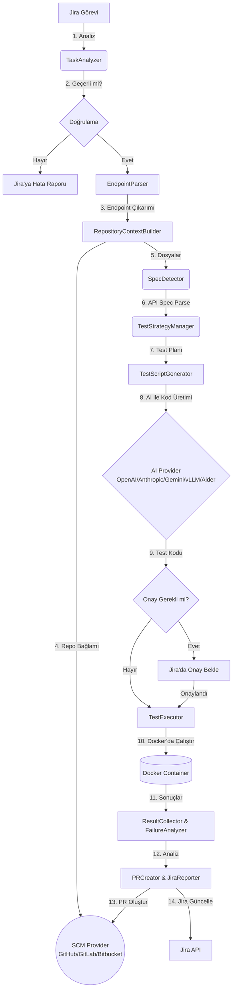

# MCP Jira Automation

Jira görevlerinden API endpoint gereksinimlerini otomatik olarak alan, AI ile test kodu üreten, izole Docker ortamlarında çalıştıran ve sonuçları Jira'ya raporlayan otonom bir API test sistemi.

Sistem; OpenAPI, Swagger ve Postman koleksiyonlarını doğrudan repodan tespit eder. pytest, Jest ve Postman gibi birden fazla test framework'ünü destekler. AI tarafında OpenAI, Anthropic, Gemini, vLLM ve Aider provider'larıyla çalışır.

---

## Mimari



### İş Akışı

1. **Görev Analizi (TaskAnalyzer)** — Jira görevindeki açıklama, özel alanlar ve etiketler okunur. Hedef repo, branch ve ortam bilgisi çıkarılır. Eksik veya belirsiz bilgiler (base URL, auth gereksinimleri vb.) işaretlenir.

2. **Endpoint Çıkarımı (EndpointParser)** — Görevden URL'ler, HTTP metotları ve beklenen durum kodları çıkarılır.

3. **Repo Bağlamı (RepositoryContextBuilder)** — Tüm repo yerine sadece ilgili dosyalar seçici şekilde alınır: route/controller dosyaları, validasyon şemaları, auth middleware'leri, framework konfigürasyonları, mevcut testler ve API spesifikasyonları.

4. **Spec Tespiti (SpecDetector)** — OpenAPI, Swagger veya Postman dosyaları deterministik olarak parse edilir. Spec ile gerçek kod arasındaki tutarsızlıklar tespit edilir.

5. **Test Stratejisi (TestStrategyManager)** — Jira gereksinimleri ve API metadata'sı birleştirilerek deterministik bir test planı oluşturulur. Zorunlu kurallar: auth testleri (401), kontrat doğrulama, negatif testler (400), RBAC testleri (403).

6. **AI ile Kod Üretimi (TestScriptGenerator)** — Test planı ve repo bağlamı kullanılarak AI modeli ile test kodu üretilir. Hedef framework'e (Jest, pytest, Supertest) uygun, repodaki mevcut kodlama stiline sadık kod çıktısı verilir. `AI_PROVIDER=aider` seçildiğinde, Aider CLI aracı devreye girer: repo'nun haritasını çıkarır, dosya bağımlılıklarını anlar ve diff-based düzenleme ile test kodunu doğrudan diske yazar.

7. **Çalıştırma (TestExecutor)** — İki modda çalışır:
   - **Remote (varsayılan):** Testler Docker container'ında çalışır ama harici API'ye (`API_BASE_URL`) istek atar. Backend ayağa kaldırılmaz, bağımlılık kurulmaz. Hızlı ve hafif.
   - **Sandbox:** Repo klonlanır, bağımlılıklar kurulur, backend Docker içinde başlatılır. Tam izolasyon.

8. **Raporlama** — Sonuçlar Jira'ya yorum olarak eklenir, PR oluşturulur, görev durumu güncellenir.

---

## Proje Yapısı

```
src/
├── ai/                    # AI provider'lar (OpenAI, Anthropic, Gemini, vLLM, Aider)
├── executor/              # Docker container yönetimi ve güvenlik politikaları
│   ├── docker.ts          # Container orchestration (clone, build, run)
│   ├── database-manager.ts# Veritabanı tespiti ve başlatma (PostgreSQL, MongoDB, MySQL, Redis)
│   ├── server-lifecycle.ts# Sunucu başlatma ve port tespiti
│   ├── container-env.ts   # Container ortam değişkenleri
│   ├── policy.ts          # Komut güvenlik politikaları
│   └── project-detector.ts# Dil ve proje tipi tespiti
├── jira/                  # Jira client, poller, webhook
├── mcp/                   # MCP Atlassian bağlantısı
├── pipeline/              # Ana pipeline orkestrasyon (handler → context → AI → Docker → PR → Jira)
├── scm/                   # SCM provider'lar (GitHub, GitLab, Bitbucket)
├── state/                 # Durum yönetimi
└── validation/            # Konfigürasyon doğrulama
```

---

## Gereksinimler

- [Node.js](https://nodejs.org/) v20+
- [Docker](https://www.docker.com/) (izole test çalıştırma için)
- Python 3 + pip (MCP Atlassian sunucusu için)
- [Aider](https://aider.chat/) (opsiyonel, `AI_PROVIDER=aider` kullanılacaksa)

---

## Kurulum

### 1. MCP Atlassian Kurulumu

```bash
pip install mcp-atlassian
cp mcp-atlassian.env.example mcp-atlassian.env
```

`mcp-atlassian.env` dosyasını düzenleyerek `JIRA_URL`, `JIRA_USERNAME`, `JIRA_API_TOKEN` değerlerini girin.

`PORT=9000` değeri, `.env` dosyasındaki `MCP_SSE_URL=http://127.0.0.1:9000/sse` ile eşleşmelidir.

Detaylı rehber: [MCP-ATLASSIAN-SETUP.md](MCP-ATLASSIAN-SETUP.md)

### 2. Jira Kurulumu

1. Jira'da bir bot hesabı oluşturun (ör. "AI Cyber Bot"). Sistem sadece bu hesaba atanan görevleri işler.
2. Jira'da "Repository" adında bir özel alan (Short text) oluşturun ve ekranlara ekleyin.
   - Alan ID'sini `.env` dosyasındaki `JIRA_REPO_FIELD_ID` değişkenine yazın.
   - Alternatif olarak görev açıklamasına `Repository: username/repo` yazabilirsiniz.
3. (Opsiyonel) Jira'da "Credentials" adında bir özel alan (Multi-line text / Paragraph) oluşturun.
   - Remote modda auth gerektiren API'ler için görev bazında credential geçirmek için kullanılır.
   - Sandbox modda gerekli değildir — backend container içinde ayağa kalkar ve auth otomatik yönetilir.
   - Alan otomatik tespit edilir. Manuel belirtmek için: `JIRA_CREDENTIALS_FIELD_ID=customfield_XXXXX`
   - Format: her satırda `KEY=VALUE` (ör. `API_KEY=sk-xxx`)
   - Değerler loglara ve Jira yorumlarına asla yazılmaz.
4. (Opsiyonel) Jira'da "Base URL" adında bir özel alan (Short text / URL) oluşturun.
   - Remote modda hedef API adresini görev bazında belirtmek için kullanılır.
   - Alan otomatik tespit edilir. Manuel belirtmek için: `JIRA_BASE_URL_FIELD_ID=customfield_XXXXX`
   - Öncelik: Custom field > description'daki `base_url:` > `.env`'deki `API_BASE_URL`

Detaylı rehber: [JIRA-REPOSITORY-GUIDE.md](JIRA-REPOSITORY-GUIDE.md)

### 3. SCM Kurulumu

Desteklenen formatlar:
- **GitHub**: `org/repo`
- **GitLab**: `group/repo` veya `group/subgroup/repo`
- **Bitbucket**: `workspace/repo`

Tam URL'ler (`https://github.com/org/repo`) de otomatik olarak parse edilir.

### 4. Konfigürasyon

```bash
git clone <repo-url>
cd mcp-jira-automation
npm install
cp .env.example .env
```

`.env` dosyasını düzenleyerek API anahtarlarını ve tercihleri girin.

### 5. Aider Kurulumu (Opsiyonel)

`AI_PROVIDER=aider` kullanmak istiyorsanız Aider CLI aracını kurun:

```bash
# uv ile (önerilen — izole ortam, Python versiyon uyumsuzluğu olmaz)
uv tool install aider-chat

# veya pip ile
pip install aider-chat
```

Aider kendi başına bir LLM değildir — arka planda bir LLM'e bağlanır. Desteklenen backend'ler:

| Backend | Gereksinim | `.env` Ayarı |
|---------|-----------|--------------|
| OpenAI (gpt-4o, gpt-4-turbo) | `OPENAI_API_KEY` | `AIDER_MODEL=gpt-4o` |
| Anthropic (claude-3.5-sonnet) | `ANTHROPIC_API_KEY` | `AIDER_MODEL=claude-3-5-sonnet` |
| Ollama (local, ücretsiz) | Ollama kurulu | `AIDER_MODEL=ollama/llama3` |
| vLLM (self-hosted) | `VLLM_BASE_URL` | `AIDER_MODEL=openai/model-name` |

```env
AI_PROVIDER=aider
AIDER_MODEL=gpt-4o
AIDER_PATH=aider          # aider binary yolu (varsayılan: aider)
OPENAI_API_KEY=sk-...     # aider'ın kullanacağı API key
```

Aider'ın diğer provider'lardan farkı:
- Repo'nun tamamının haritasını çıkarır (repo map)
- Dosya bağımlılıklarını anlar
- Diff-based düzenleme yapar (tüm dosyayı yeniden yazmak yerine)
- Mevcut kod stilini otomatik algılar

---

## Çalıştırma

### CLI Aracı (Önerilen)

```bash
npm run build
npm link

mja run     # Her şeyi başlat (MCP + Uygulama)
mja mcp     # Sadece MCP Atlassian
mja app     # Sadece ana uygulama
mja help    # Yardım
```

`npm link` kullanmadan:

```bash
npm run mja        # Her şeyi başlat
npm run mja:mcp    # Sadece MCP
npm run mja:app    # Sadece uygulama
```

### Platform Scriptleri

**Windows:**
```cmd
.\scripts\windows\start-all.bat
```

**Linux/Mac:**
```bash
chmod +x scripts/unix/*.sh
./scripts/unix/start-all.sh
```

### Manuel Başlatma

Terminal 1 — MCP Atlassian:
```bash
mcp-atlassian --env-file mcp-atlassian.env --transport sse --port 9000 -vv
```

Terminal 2 — Ana Uygulama:
```bash
npm run build
npm run start
```

### Docker Compose

```bash
docker-compose up -d
```

Üç servis başlatır:
- **mcp-atlassian** — Jira MCP sunucusu (port 9000)
- **docker-socket-proxy** — Güvenli Docker socket proxy
- **runner** — Ana uygulama (read-only, kaynak limitli, izole)

---

## Kullanım

### 1. Jira Görevi Oluşturun

Bot hesabına atanmış, endpoint gereksinimlerini içeren bir görev oluşturun.

**Markdown formatı:**
```markdown
Summary: Kullanıcı API Testleri

Description:
Kullanıcı endpoint'lerinin doğru çalıştığını ve hatalı ID'leri düzgün ele aldığını doğrula.

| Method | URL | Expected Status | Auth Type | Test Scenarios |
|--------|-----|-----------------|-----------|----------------|
| GET | /api/users | 200 | Bearer | success, unauthorized |
| POST | /api/users | 201 | Bearer | success, validation_error |
| GET | /api/users/{id} | 200 | Bearer | success, not_found |

Repository: org/backend-api
```

### 2. Otomatik İşlem

Sistem iki çalışma modunu destekler:

#### Remote Mod (Varsayılan)

Zaten çalışan bir servise (staging, dev vb.) karşı test koşar. Hızlı ve hafiftir — backend ayağa kaldırılmaz, bağımlılık kurulmaz.

```env
EXECUTION_MODE=remote
API_BASE_URL=https://staging-api.example.com
```

API Base URL şu öncelik sırasıyla belirlenir:
1. Jira görev açıklamasındaki `base_url: https://...` (en yüksek öncelik)
2. `.env` dosyasındaki `API_BASE_URL`
3. Repo README dosyasından otomatik tespit (ör. README'de `https://f1api.dev` geçiyorsa)

Jira raporunda hangi URL'in hangi kaynaktan kullanıldığı belirtilir.

Akış:
1. Jira görevini alır ve analiz eder
2. Repodan ilgili dosyaları ve API spec'lerini çeker (test stratejisi için)
3. AI ile test kodu üretir
4. Docker container'ında Python testlerini `API_BASE_URL`'e karşı çalıştırır
5. Sonuçları Jira'ya raporlar ve PR oluşturur

#### Sandbox Mod

Backend'i Docker container içinde klonlar, kurar ve ayağa kaldırır. Harici ortam olmadığında kullanılır.

```env
EXECUTION_MODE=sandbox
```

Akış:
1. Jira görevini alır ve analiz eder
2. Repodan ilgili dosyaları ve API spec'lerini çeker
3. AI ile test kodu üretir
4. Docker'da repo klonlanır, bağımlılıklar kurulur, backend başlatılır
5. Testler container içindeki servise karşı çalıştırılır
6. Sonuçları Jira'ya raporlar ve PR oluşturur

#### Görev Bazlı Override

Jira görev açıklamasına aşağıdaki alanları ekleyerek görev bazında çalışma modunu değiştirebilirsiniz. Bu, `.env`'deki global `EXECUTION_MODE` ayarını o görev için override eder.

| Alan | Açıklama | Örnek |
|------|----------|-------|
| `base_url` | Hedef API adresi (otomatik olarak remote moda geçirir) | `base_url: https://staging.example.com` |
| `execution_mode` | Çalışma modunu açıkça belirler | `execution_mode: sandbox` |

Öncelik sırası: `execution_mode` > `base_url` varlığı > `.env` ayarı

**Örnek 1 — Remote mod (harici servise test):**

```markdown
Summary: F1 API Testleri

Description:
base_url: https://f1api.dev

F1 API endpoint'lerini test et.

| Method | URL | Expected Status |
|--------|-----|-----------------|
| GET | /api/drivers | 200 |
| GET | /api/seasons | 200 |

Repository: rafacv23/f1-api
```

**Örnek 2 — Sandbox mod (backend Docker'da ayağa kalkar):**

```markdown
Summary: Backend API Testleri

Description:
execution_mode: sandbox

Kullanıcı endpoint'lerini test et.

| Method | URL | Expected Status | Auth Type |
|--------|-----|-----------------|-----------|
| GET | /api/users | 200 | Bearer |
| POST | /api/users | 201 | Bearer |

Repository: org/backend-api
```

**Örnek 3 — Global ayar remote ama bu görev sandbox olsun:**

`.env`'de `EXECUTION_MODE=remote` olsa bile, görev açıklamasına `execution_mode: sandbox` yazarak o görev için backend'i Docker'da ayağa kaldırabilirsiniz.

---

## Konfigürasyon Referansı

| Değişken | Açıklama |
|----------|----------|
| `JIRA_BASE_URL` | Jira sunucu adresi (`https://company.atlassian.net`) |
| `JIRA_EMAIL` | Jira hesap e-postası |
| `JIRA_API_TOKEN` | Jira API erişim token'ı |
| `JIRA_PROJECT_KEY` | Jira proje anahtarı (ör. `KAN`) |
| `JIRA_AI_BOT_DISPLAY_NAME` | Bot'un Jira'daki görünen adı |
| `JIRA_REPO_FIELD_ID` | Repository özel alan ID'si (opsiyonel, otomatik tespit edilir) |
| `JIRA_CREDENTIALS_FIELD_ID` | Credentials özel alan ID'si (opsiyonel, otomatik tespit edilir) |
| `JIRA_BASE_URL_FIELD_ID` | Base URL özel alan ID'si (opsiyonel, otomatik tespit edilir) |
| `MODE` | Dinleme modu: `poll` veya `webhook` |
| `POLL_INTERVAL_MS` | Polling aralığı (ms) |
| `SCM_PROVIDER` | `github`, `gitlab` veya `bitbucket` |
| `GITHUB_TOKEN` | GitHub erişim token'ı |
| `AI_PROVIDER` | `openai`, `anthropic`, `gemini`, `vllm` veya `aider` |
| `AI_MODEL` | AI model adı (opsiyonel, provider'a göre otomatik) |
| `AIDER_MODEL` | Aider'ın kullanacağı model (ör. `gpt-4o`, `claude-3-5-sonnet`) |
| `AIDER_PATH` | Aider binary yolu (varsayılan: `aider`) |
| `EXECUTION_MODE` | `remote` (varsayılan): harici servise test koş, `sandbox`: Docker'da backend ayağa kaldır |
| `API_BASE_URL` | Remote modda hedef API adresi (ör. `https://staging-api.example.com`) |
| `EXEC_POLICY` | Çalıştırma politikası: `strict` veya `permissive` |
| `DOCKER_IMAGE` | Docker imajı: `auto` veya spesifik (ör. `node:20-bookworm`) |
| `EXEC_TIMEOUT_MS` | Test çalıştırma zaman aşımı (ms) |
| `REQUIRE_APPROVAL` | Test çalıştırma öncesi Jira onayı (`true`/`false`) |
| `MCP_SSE_URL` | MCP Atlassian SSE URL'i |
| `LOG_LEVEL` | Log seviyesi: `debug`, `info`, `warn`, `error` |
| `MAX_ATTEMPTS` | Başarısız görevler için maksimum deneme sayısı |

---

## Genişletilebilirlik

- **AI Provider Ekleme** — `src/ai/` altına yeni provider dosyası ekleyin ve interface'i kaydedin.
- **Test Framework Ekleme** — `TestScriptGenerator` içindeki şablon üretim mantığını genişletin.
- **Özel Context Parser** — `ContextRetrieval` modülünü genişleterek farklı proje yapılarını veya dokümantasyon kaynaklarını destekleyin.
- **SCM Provider Ekleme** — `src/scm/` altına yeni provider ekleyin ve `provider.ts`'deki factory'ye kaydedin.

---

## Lisans

MIT License. Detaylar için [LICENSE](LICENSE) dosyasına bakın.
