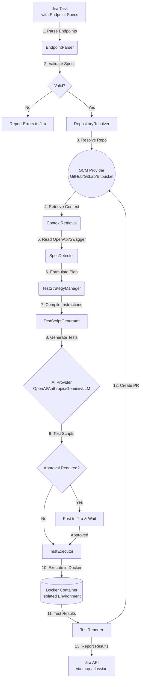

# MCP Jira Automation

**MCP Jira Automation** is an **autonomous API testing and workflow automation system**. It automatically retrieves API endpoint specifications from Jira tasks, retrieves repository context and API specs using the Model Context Protocol (MCP), formulates a deterministic test strategy, generates comprehensive test scripts using AI models (OpenAI/Anthropic/Gemini/vLLM), executes tests in isolated Docker environments, and reports results back to Jira with pull requests containing the generated tests.

This system transforms abstract API endpoint requirements into production-ready test suites, supporting multiple test frameworks (pytest, Jest, Postman) and intelligently detecting specifications such as OpenAPI, Swagger, and Postman collections directly from the repository.

---

## 🏗️ Architecture and Working Logic

Our hybrid determinist-AI pipeline ensures reliable test extraction while leveraging AI for the complex task of script generation.



### Key Features
- **Deterministic API Spec Detection**: Automatically detects and parses OpenAPI, Swagger, and Postman collections directly from the target codebase (`SpecDetector`).
- **Structured Test Strategies**: Creates formal test plans covering authentication, negative path testing, and contract validation without relying on AI guessing (`TestStrategyManager`).
- **Endpoint Specification Parsing**: Supports JSON, YAML, and Markdown table formats for explicitly defining or supplementing API endpoints inside Jira tasks.
- **AI-Powered Test Generation**: The prompt provides structured constraints to the AI, which generates complete functional test suites, schema validation, and edge cases.
- **Framework Detection**: Automatically detects and uses the appropriate test framework (pytest with requests, Jest with supertest, or Postman collections).
- **Isolated Test Execution**: Tests run in ephemeral Docker containers with timeout protection and resource limits.
- **Approval Workflow**: Optional review gate where generated tests can be reviewed before execution (`REQUIRE_APPROVAL=true`).
- **Automatic PR Creation**: Generated test scripts are committed to a branch and opened as a pull request with detailed test results.
- **Provider Independent**: Switch between GitHub/GitLab/Bitbucket and OpenAI/Anthropic/Gemini/vLLM with simple configuration.

---

## 🚀 Installation

### Prerequisites
1. [Node.js](https://nodejs.org/) (v20+)
2. [Docker](https://www.docker.com/) (Required for isolated test execution)
3. Python 3 and pip (For Atlassian/Bitbucket MCP servers)

### 0. MCP Atlassian Setup (IMPORTANT!)
This project leverages the MCP Atlassian server to communicate seamlessly with Jira:

```bash
# Install MCP Atlassian
pip install mcp-atlassian

# Copy the environment example
cp mcp-atlassian.env.example mcp-atlassian.env

# Edit the mcp-atlassian.env file to enter your Jira information
# Fill in JIRA_URL, JIRA_USERNAME, JIRA_API_TOKEN
```

**Note:** The `PORT=9000` value in the `mcp-atlassian.env` file must match `MCP_SSE_URL=http://127.0.0.1:9000/sse` in the main `.env` file.

For detailed setup: [MCP-ATLASSIAN-SETUP.md](MCP-ATLASSIAN-SETUP.md)

### 1. Jira Setup
1. Create a user/bot account named (e.g., **"MCP Automation Bot"**) in your Jira environment. The system only processes tasks assigned to this account.
2. Create a custom field named **"Repository"** (`Short text` format) in Jira's custom fields and add it to screens.
   - *Enter this field's ID in the `JIRA_REPO_FIELD_ID` in `.env`.*
   - Alternatively, you can include `Repository: username/repo` anywhere in the task description.

For detailed guides: [JIRA-REPOSITORY-GUIDE.md](JIRA-REPOSITORY-GUIDE.md)

### 2. SCM Setup
The system supports multiple SCM providers by parsing identifiers. Supply them in the formatting:
- **GitHub**: `org/repo`
- **GitLab**: `group/repo` or `group/subgroup/repo`
- **Bitbucket**: `workspace/repo`

*(Providing full URLs like `https://github.com/org/repo` will be parsed securely automatically).*

### 3. Configuration (`.env`)
Clone the repository and set up environment bindings:
```bash
cp .env.example .env
```
Populate `.env` with API keys and preferences (Detailed comments inside the file guide you).

### 4. Running the System

#### Option 1: Automatic Startup (Windows - Recommended)
The `start-all.bat` script boots both the MCP server and the node application.
```cmd
.\scripts\start-all.bat
```

#### Option 2: Linux/Mac OS
```bash
chmod +x scripts/*.sh
./scripts/start-all.sh
```

#### Option 3: Manual Startup
Terminal 1 (MCP Atlassian):
```bash
mcp-atlassian --env-file mcp-atlassian.env --transport sse --port 9000 -vv
```

Terminal 2 (Main Application):
```bash
npm install
npm run build
npm run start
```

#### Option 4: Docker Compose
Run isolated background services:
```bash
docker-compose up -d
```

---

## 🧪 Quick Test Workflow

### Step 1: Assign a Task
Create a Jira Task assigned to the bot containing endpoint requirements. **MCP Jira Automation** will augment these requests utilizing the OpenAPI specs located in your repository (if present).

### Step 2: Jira Description Context
Provide endpoint requests inside the task using JSON, YAML, or Markdown.

**Markdown Example:**
```markdown
Summary: Test User Automation Features

Description:
Ensure the user endpoints perform successfully and handle invalid IDs.

| Method | URL | Expected Status | Auth Type | Test Scenarios |
|--------|-----|-----------------|-----------|----------------|
| GET | /api/users | 200 | Bearer | success, unauthorized |
| POST | /api/users | 201 | Bearer | success, validation_error, unauthorized |
| GET | /api/users/{id} | 200 | Bearer | success, not_found |

Repository: org/backend-api
```

### Step 3: Monitor Execution
The Pipeline orchestrator automatically acts on the Jira listener state:
```text
INFO - Found 1 issue: PROJ-123
INFO - Processing issue PROJ-123
INFO - Parsing endpoint specifications...
INFO - Found 3 endpoints to test
INFO - Repository: org/backend-api
INFO - Retrieving relevant files from repository...
INFO - SpecDetector: Extracted 20 unique endpoints from 1 specification files
INFO - TestStrategy: Test plan generated with 3 endpoints and 2 coverage requirements
INFO - Detected test framework: pytest + requests
INFO - Generating comprehensive test suite using vLLM...
INFO - Executing tests in Docker container...
INFO - Tests passed! (12/12 tests)
INFO - Creating Pull Request...
✅ Issue PROJ-123 completed successfully
```

### Expected Deliverables
The system reports back with:
- Extensively detailed test result outputs directly on the Jira task comment threads
- Updates task workflow states
- Raises a PR against the `org/backend-api` repo containing the generated scripts (e.g. `tests/api/test_users.py`) for CI/CD ingestion.

---

## ⚙️ Key Technical Configuration

| Variable | Description |
|----------|----------|
| **Jira Settings** | |
| `JIRA_BASE_URL` | Your Jira server address, e.g., `https://company.atlassian.net`. |
| `JIRA_API_TOKEN` | Jira API access token. |
| `JIRA_REPO_FIELD_ID` | Backend ID of the "Repository" custom field you added. |
| **SCM Selection** | |
| `SCM_PROVIDER` | `github`, `gitlab`, or `bitbucket`. |
| **AI Selection** | |
| `AI_PROVIDER` | `openai`, `anthropic`, `gemini`, or `vllm`. |
| **API Testing Engine** | |
| `REQUIRE_APPROVAL` | Require manual Jira developer approval prior to `TestExecutor` container spin-up. |
| `TEST_TIMEOUT_SECONDS` | Maximum time allowed for test execution (e.g. `300`). |

---

## 🔧 Extensibility

The codebase supports straightforward expansion:
- **Adding AI Providers**: Add `[provider].ts` logic under `src/ai/` and register mapped interfaces.
- **Adding Testing Frameworks**: Extend template generation logic inside `TestScriptGenerator.ts`.
- **Custom Context Parsers**: Expand logic in the `ContextRetrieval` to fetch or interpret broader project graphs or documentation wikis.

---

## 📄 License
This project is licensed under the MIT License. See the [LICENSE](LICENSE) file for details.
