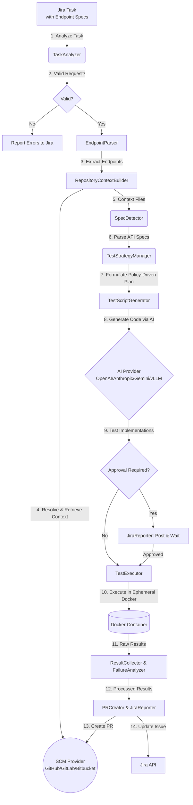

# MCP Jira Automation

**MCP Jira Automation** is an **autonomous API testing and workflow automation system**. It automatically retrieves API endpoint specifications from Jira tasks, retrieves repository context and API specs using the Model Context Protocol (MCP), formulates a deterministic test strategy, generates comprehensive test scripts using AI models (OpenAI/Anthropic/Gemini/vLLM), executes tests in isolated Docker environments, and reports results back to Jira with pull requests containing the generated tests.

This system transforms abstract API endpoint requirements into production-ready test suites, supporting multiple test frameworks (pytest, Jest, Postman) and intelligently detecting specifications such as OpenAPI, Swagger, and Postman collections directly from the repository.

---

## 🏗️ Architecture and Working Logic

The system is a mostly autonomous, policy-gated API testing automation platform that integrates directly with issue trackers like Jira. It is designed to interpret API testing requirements, gather deep repository context, formulate deterministic test strategies, and use AI to generate test implementations. These tests are executed securely in an isolated environment, and the results, along with proposed pull requests, are reported back to the engineering team. Optional human approval steps ensure quality, compliance, and security throughout the automation lifecycle.



### 1. Task Analysis and Interpretation (TaskAnalyzer)
The process begins when a Jira task is created or updated. Instead of immediately parsing endpoints from text, the `TaskAnalyzer` (or `IssueInterpreter`) serves as the primary ingress layer.
- **Reads Jira Task Fields**: Parses the description, custom fields, and labels to understand the overall objective.
- **Extracts Repository Information**: Identifies which repository, branch, or environment is targeted.
- **Determines Required Processing**: Evaluates whether explicit endpoint parsing is required based on the task description.
- **Detects Ambiguity**: Flags missing or ambiguous information (e.g., a missing base URL or incomplete authentication requirements) before proceeding.
- **Normalizes Task Input**: Standardizes the developer's request into a uniform, structured format for downstream services to consume.

### 2. Endpoint Specification Extraction (EndpointParser)
Once the task is analyzed and verified as actionable, the `EndpointParser` processes the normalized task input. It extracts the explicitly targeted URLs, HTTP methods (GET, POST, etc.), and expected status codes (e.g., 200, 404), forming a baseline of what the developer explicitly wants tested.

### 3. Repository Context Retrieval (RepositoryContextBuilder)
To generate tests that conform to the target project's standards, the system must understand the codebase. Fetching the entire repository is slow and often exceeds AI token limits. Instead, the `RepositoryContextBuilder` selectively and intelligently retrieves files relevant to API behavior and testing patterns:
- **Route and Controller Files**: To understand how the API maps to underlying business logic.
- **Validation Schemas**: To identify required payloads, data types, and bounds.
- **Authentication Middleware**: To understand how endpoints are secured and authorized.
- **Framework Configuration Files**: (e.g., `package.json`, `requirements.txt`, `pytest.ini`) to determine test runners and dependencies.
- **Existing Test Files**: (e.g., `tests/api` or `__tests__/api`) to analyze the repository's preferred testing style, coding guidelines, and fixture usage.
- **API Specifications**: Locating files such as `openapi.yaml`, `swagger.json`, or Postman collections.

### 4. Parsing API Technical Specifications (SpecDetector)
Rather than relying on an AI model to guess API mechanics, the `SpecDetector` deterministically evaluates the API specifications located by the `RepositoryContextBuilder`.
- **Detects and Parses Specs**: Deterministically parses OpenAPI, Swagger, or Postman files.
- **Evaluates Reliability**: Checks if the specification is complete, accurate, and up-to-date.
- **Detects Inconsistencies**: Analyzes and flags discrepancies between the documented specification and the retrieved route/controller code.
- **Provides Normalized Metadata**: Exposes a structured representation of the API (including required query parameters, JSON schemas for request/response bodies, and authentication schemes).

### 5. Building the Test Strategy (TestStrategyManager)
The strategy layer combines the normalized Jira requirements and the parsed API metadata to construct a deterministic, policy-driven `TestPlan`. While AI may assist, it does not replace the deterministic strategy logic. Strict internal policies govern test coverage:
- **Authentication Tests**: If an endpoint requires authentication, tests asserting `401 Unauthorized` responses must automatically be generated.
- **Contract Validation**: If an OpenAPI schema is present, response payload contract validation tests are mandated.
- **Negative Testing**: Edge cases and validation failure tests (e.g., `400 Bad Request` or missing required fields) are strictly enforced.
- **Permission Tests**: If Role-Based Access Control (RBAC) is detected, the strategy requires tests simulating varying permission boundary checks (e.g., `403 Forbidden`).

### 6. Generating Test Code with AI (TestScriptGenerator)
Given the comprehensive `TestPlan` and repository context, the `TestScriptGenerator` prompts an AI model (such as OpenAI, Gemini, or vLLM) to produce the actual test implementations.
- **Uses AI to Generate Implementations**: Transforms the test plan into actionable code logic.
- **Adapts to Test Frameworks**: Emits code utilizing the target repository's preferred framework (e.g., Jest, Pytest, Supertest).
- **Follows Existing Patterns**: Adheres to the exact coding style, assertion formats, and patterns currently used in the repository.
- **Integrates with Helpers**: Leverages pre-existing setup routines, teardowns, and fixture factories found in the codebase.
- **Avoids Hardcoding Secrets**: Ensures environment variables are securely used in place of sensitive tokens.
- **Validates Output**: Optionally runs linter or syntax checks on the generated scripts to guarantee executable code before proceeding.

### 7. Secure Test Execution (TestExecutor)
Executing autogenerated code requires strict containment to maintain host safety. The `TestExecutor` manages a highly controlled, ephemeral execution environment.
- **Ephemeral Containers**: Spins up a single-use, isolated Docker container specifically for the test run.
- **Dependency Installation**: Dynamically installs required framework packages (e.g., `npm install` or `pip install`) utilizing cached layers for speed.
- **Network Isolation**: Restricts default network access to prevent unauthorized outbound requests or data leakage.
- **Resource Limits**: Enforces strict CPU, memory, and disk I/O quotas to prevent system exhaustion.
- **Execution Timeout**: Applies rigid time limits to execution to prevent infinite loops.
- **Artifact Collection**: Safely harvests execution logs, request/response dumps, and test output artifacts immediately after the run, destroying the container afterward.

### 8. Reporting and Notification
Once execution completes, post-processing is strictly decoupled and handled by specialized reporting services.
- **ResultCollector**: Aggregates the raw test outcomes, coverage metrics, and execution artifacts from the Docker container.
- **FailureAnalyzer**: Inspects failed tests or execution crashes to provide insights and actionable debugging feedback.
- **PRCreator**: Automatically pushes the generated test scripts and any necessary configuration updates to a new branch, creating a Pull Request against the target repository.
- **JiraReporter**: Posts a detailed markdown summary as a comment on the originating Jira task and transitions the Jira issue status, setting up the optional human approval step.
---

## 🚀 Installation

### Prerequisites
1. [Node.js](https://nodejs.org/) (v20+)
2. [Docker](https://www.docker.com/) (Required for isolated test execution)
3. Python 3 and pip (For Atlassian/Bitbucket MCP servers)

### 0. MCP Atlassian Setup (IMPORTANT!)
This project leverages the MCP Atlassian server to communicate seamlessly with Jira:

```bash
# Install MCP Atlassian
pip install mcp-atlassian

# Copy the environment example
cp mcp-atlassian.env.example mcp-atlassian.env

# Edit the mcp-atlassian.env file to enter your Jira information
# Fill in JIRA_URL, JIRA_USERNAME, JIRA_API_TOKEN
```

**Note:** The `PORT=9000` value in the `mcp-atlassian.env` file must match `MCP_SSE_URL=http://127.0.0.1:9000/sse` in the main `.env` file.

For detailed setup: [MCP-ATLASSIAN-SETUP.md](MCP-ATLASSIAN-SETUP.md)

### 1. Jira Setup
1. Create a user/bot account named (e.g., **"MCP Automation Bot"**) in your Jira environment. The system only processes tasks assigned to this account.
2. Create a custom field named **"Repository"** (`Short text` format) in Jira's custom fields and add it to screens.
   - *Enter this field's ID in the `JIRA_REPO_FIELD_ID` in `.env`.*
   - Alternatively, you can include `Repository: username/repo` anywhere in the task description.

For detailed guides: [JIRA-REPOSITORY-GUIDE.md](JIRA-REPOSITORY-GUIDE.md)

### 2. SCM Setup
The system supports multiple SCM providers by parsing identifiers. Supply them in the formatting:
- **GitHub**: `org/repo`
- **GitLab**: `group/repo` or `group/subgroup/repo`
- **Bitbucket**: `workspace/repo`

*(Providing full URLs like `https://github.com/org/repo` will be parsed securely automatically).*

### 3. Configuration (`.env`)
Clone the repository and set up environment bindings:
```bash
cp .env.example .env
```
Populate `.env` with API keys and preferences (Detailed comments inside the file guide you).

### 4. Running the System

#### Option 1: Automatic Startup (Windows - Recommended)
The `start-all.bat` script boots both the MCP server and the node application.
```cmd
.\scripts\start-all.bat
```

#### Option 2: Linux/Mac OS
```bash
chmod +x scripts/*.sh
./scripts/start-all.sh
```

#### Option 3: Manual Startup
Terminal 1 (MCP Atlassian):
```bash
mcp-atlassian --env-file mcp-atlassian.env --transport sse --port 9000 -vv
```

Terminal 2 (Main Application):
```bash
npm install
npm run build
npm run start
```

#### Option 4: Docker Compose
Run isolated background services:
```bash
docker-compose up -d
```

---

## 🧪 Quick Test Workflow

### Step 1: Assign a Task
Create a Jira Task assigned to the bot containing endpoint requirements. **MCP Jira Automation** will augment these requests utilizing the OpenAPI specs located in your repository (if present).

### Step 2: Jira Description Context
Provide endpoint requests inside the task using JSON, YAML, or Markdown.

**Markdown Example:**
```markdown
Summary: Test User Automation Features

Description:
Ensure the user endpoints perform successfully and handle invalid IDs.

| Method | URL | Expected Status | Auth Type | Test Scenarios |
|--------|-----|-----------------|-----------|----------------|
| GET | /api/users | 200 | Bearer | success, unauthorized |
| POST | /api/users | 201 | Bearer | success, validation_error, unauthorized |
| GET | /api/users/{id} | 200 | Bearer | success, not_found |

Repository: org/backend-api
```

### Step 3: Monitor Execution
The Pipeline orchestrator automatically acts on the Jira listener state:
```text
INFO - Found 1 issue: PROJ-123
INFO - Processing issue PROJ-123
INFO - Parsing endpoint specifications...
INFO - Found 3 endpoints to test
INFO - Repository: org/backend-api
INFO - Retrieving relevant files from repository...
INFO - SpecDetector: Extracted 20 unique endpoints from 1 specification files
INFO - TestStrategy: Test plan generated with 3 endpoints and 2 coverage requirements
INFO - Detected test framework: pytest + requests
INFO - Generating comprehensive test suite using vLLM...
INFO - Executing tests in Docker container...
INFO - Tests passed! (12/12 tests)
INFO - Creating Pull Request...
✅ Issue PROJ-123 completed successfully
```

### Expected Deliverables
The system reports back with:
- Extensively detailed test result outputs directly on the Jira task comment threads
- Updates task workflow states
- Raises a PR against the `org/backend-api` repo containing the generated scripts (e.g. `tests/api/test_users.py`) for CI/CD ingestion.

---

## ⚙️ Key Technical Configuration

| Variable | Description |
|----------|----------|
| **Jira Settings** | |
| `JIRA_BASE_URL` | Your Jira server address, e.g., `https://company.atlassian.net`. |
| `JIRA_API_TOKEN` | Jira API access token. |
| `JIRA_REPO_FIELD_ID` | Backend ID of the "Repository" custom field you added. |
| **SCM Selection** | |
| `SCM_PROVIDER` | `github`, `gitlab`, or `bitbucket`. |
| **AI Selection** | |
| `AI_PROVIDER` | `openai`, `anthropic`, `gemini`, or `vllm`. |
| **API Testing Engine** | |
| `REQUIRE_APPROVAL` | Require manual Jira developer approval prior to `TestExecutor` container spin-up. |
| `TEST_TIMEOUT_SECONDS` | Maximum time allowed for test execution (e.g. `300`). |

---

## 🔧 Extensibility

The codebase supports straightforward expansion:
- **Adding AI Providers**: Add `[provider].ts` logic under `src/ai/` and register mapped interfaces.
- **Adding Testing Frameworks**: Extend template generation logic inside `TestScriptGenerator.ts`.
- **Custom Context Parsers**: Expand logic in the `ContextRetrieval` to fetch or interpret broader project graphs or documentation wikis.

---

## 📄 License
This project is licensed under the MIT License. See the [LICENSE](LICENSE) file for details.
