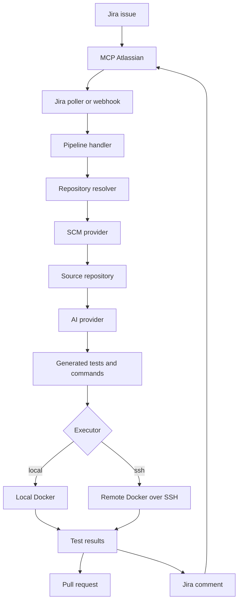

# MCP Jira Automation

MCP Jira Automation is an AI-assisted automation service for Jira-driven development workflows. It polls or receives Jira issues, resolves the target source repository, generates or updates tests with an AI provider, executes them in Docker, opens a pull request, and reports the outcome back to Jira.

The service is designed to work with a separately running `mcp-atlassian` server, which provides Jira access through the Model Context Protocol.

## Architecture

```text
mcp-atlassian (standalone service, port 9000)
    -> mcp-jira-automation (this project)
```



## Capabilities

- Reads Jira issues through `mcp-atlassian`.
- Resolves repositories from Jira custom fields, issue descriptions, or repository URLs.
- Supports GitHub, GitLab, and Bitbucket source control integrations.
- Uses OpenAI, Anthropic, Gemini, vLLM, or Aider for AI-assisted test generation.
- Runs generated tests against an existing remote API or inside an isolated Docker sandbox.
- Supports local Docker execution and remote Docker execution over SSH.
- Creates pull requests with generated test changes.
- Posts execution summaries and failures back to Jira.
- Supports per-issue prompt overrides and global custom prompts.

## Requirements

- Node.js 20 or later
- Docker, when using the local executor or sandbox mode
- Access token for GitHub, GitLab, or Bitbucket
- A running `mcp-atlassian` service
- Credentials for at least one AI provider, or Aider CLI access

## Installation

Install dependencies, build the project, and link the `mja` CLI:

```bash
npm install
npm run build
npm install -g .
```

Create local configuration files:

```bash
cp .env.example .env
cp mcp-atlassian.env.example mcp-atlassian.env
```

Edit both files with your Jira, SCM, AI provider, executor, and MCP settings.

## Running the Services

Start `mcp-atlassian` first. See the upstream project for installation details:

https://github.com/sooperset/mcp-atlassian

Example:

```bash
cd /path/to/mcp-atlassian
uv run mcp-atlassian --transport streamable-http --host 0.0.0.0 --port 9000 --path /mcp
```

If you use `UV_ENV_FILE`, point it to your `mcp-atlassian.env` file so the MCP service can load the Jira credentials:

```powershell
[Environment]::SetEnvironmentVariable("UV_ENV_FILE", "C:\path\to\mcp-atlassian.env", "User")
```

Then start the automation service:

```bash
mja app
```

Useful CLI commands:

```bash
mja app
mja help
```

## Jira Workflow

The service polls Jira with a JQL query, unless webhook mode is enabled. The default query can be replaced with `JQL_ASSIGNED_TO_BOT`.

For each matching issue, the service:

1. Reads issue metadata and description.
2. Resolves the target repository.
3. Clones or accesses the repository through the configured SCM provider.
4. Builds an AI prompt from the issue, repository context, and optional prompt overrides.
5. Generates test changes.
6. Runs the tests with the configured execution backend.
7. Creates a pull request.
8. Posts the result to Jira.

### Repository Resolution

The target repository is resolved in this order:

1. Jira `Repository` custom field.
2. A `Repository: owner/repo` line in the issue description.
3. A GitHub, GitLab, or Bitbucket URL in the issue description.

### Issue Description Example

```text
Repository: ahmet/example-api

base_url: https://staging.example.com

Test the authentication endpoints:
- POST /api/auth/register
- POST /api/auth/login
- GET /api/auth/profile
```

### Per-Issue Overrides

| Field | Description |
| --- | --- |
| `base_url: https://...` | Target API URL for this issue. This implicitly enables remote execution for the task. |
| `execution_mode: remote` | Runs tests against an already running API. |
| `execution_mode: sandbox` | Starts the backend in Docker and runs tests locally inside the sandbox. |

### Per-Issue Prompt Override

Add a `[PROMPT]...[/PROMPT]` block to the issue description to provide task-specific AI instructions:

```text
Repository: ahmet/example-api

[PROMPT]
Only test the /auth endpoints.
Write test names and comments in English.
[/PROMPT]
```

## Prompt Customization

The system prompt can be customized at three levels:

| Level | Method | Scope |
| --- | --- | --- |
| Global | Create `prompts/custom.md` | All issues |
| Global | Set `CUSTOM_PROMPT_FILE=/path/to/prompt.md` in `.env` | All issues |
| Per issue | Add `[PROMPT]...[/PROMPT]` to the Jira description | Single issue |

Use `prompts/custom.md.example` as a starting point.

## Execution Modes

### Remote Mode

Remote mode generates and runs tests against an already running API. It does not install backend dependencies or start application services.

```env
EXECUTION_MODE=remote
API_BASE_URL=https://staging-api.example.com
```

The API base URL is resolved in this order:

1. Jira custom field or `base_url` in the issue description.
2. `API_BASE_URL` in `.env`.
3. Automatic detection from the repository README, when available.

### Sandbox Mode

Sandbox mode clones the repository into Docker, detects the project type, installs dependencies, starts backend services, and runs tests in isolation.

```env
EXECUTION_MODE=sandbox
```

## Executor Backends

### Local Docker

Use the local backend when Docker runs on the same machine as this service:

```env
EXECUTOR_BACKEND=local
```

### SSH Docker

Use the SSH backend when Docker runs on a remote host:

```env
EXECUTOR_BACKEND=ssh
SSH_HOST=192.0.2.10
SSH_PORT=22
SSH_USER=ubuntu
SSH_PRIVATE_KEY_PATH=/home/user/.ssh/id_rsa
SSH_REMOTE_WORKDIR=/opt/mcp-jira-automation/workspaces
SSH_CLEANUP_WORKSPACE=true
SSH_REMOVE_IMAGE=false
```

The remote user must have access to `git` and Docker.

## AI Providers

Select the AI provider with `AI_PROVIDER`:

```env
AI_PROVIDER=openai
AI_MODEL=gpt-4o
```

Supported values:

- `openai`
- `anthropic`
- `gemini`
- `vllm`
- `aider`

For Aider:

```env
AI_PROVIDER=aider
AIDER_MODEL=gpt-4o
AIDER_PATH=aider
OPENAI_API_KEY=sk-...
```

`aider` is treated as an external CLI dependency. Keep it outside this repository:

- Use `AIDER_PATH=aider` when the command is available on `PATH`.
- Or set `AIDER_PATH` to an absolute executable path outside the project directory.
- Project-local paths such as `./aider`, `.venv/.../aider`, or `node_modules/.bin/aider` are rejected.
- The Docker runner image does not install Aider. If you run with `AI_PROVIDER=aider` in Docker, provide Aider from outside the project through your runtime image or host/container environment and set `AIDER_PATH` accordingly.

## Configuration Reference

### Application Environment

| Variable | Description |
| --- | --- |
| `JIRA_BASE_URL` | Jira base URL. |
| `JIRA_EMAIL` | Jira account email. |
| `JIRA_API_TOKEN` | Jira API token. |
| `JIRA_PROJECT_KEY` | Jira project key. |
| `JIRA_AI_BOT_DISPLAY_NAME` | Jira display name of the bot user. |
| `JIRA_REPO_FIELD_ID` | Optional repository custom field ID. Auto-detected when omitted. |
| `JIRA_CREDENTIALS_FIELD_ID` | Optional credentials custom field ID. |
| `JIRA_BASE_URL_FIELD_ID` | Optional base URL custom field ID. |
| `JQL_ASSIGNED_TO_BOT` | Optional JQL override. |
| `MODE` | `poll` or `webhook`. |
| `POLL_INTERVAL_MS` | Polling interval in milliseconds. |
| `WEBHOOK_PORT` | HTTP port for webhook mode. |
| `WEBHOOK_SECRET` | HMAC secret used to verify webhook signatures. |
| `SCM_PROVIDER` | `github`, `gitlab`, or `bitbucket`. |
| `GITHUB_TOKEN` | GitHub access token. |
| `GITLAB_TOKEN` | GitLab access token. |
| `GITLAB_URL` | GitLab base URL. Defaults to GitLab.com when omitted. |
| `BITBUCKET_EMAIL` | Atlassian account email for Bitbucket Cloud API access. |
| `BITBUCKET_API_TOKEN` | Bitbucket API token. |
| `BITBUCKET_USERNAME` | Optional Bitbucket username. |
| `BITBUCKET_WORKSPACE` | Optional Bitbucket workspace. |
| `AI_PROVIDER` | `openai`, `anthropic`, `gemini`, `vllm`, or `aider`. |
| `AI_MODEL` | Model name for the selected provider. |
| `OPENAI_API_KEY` | OpenAI API key. |
| `ANTHROPIC_API_KEY` | Anthropic API key. |
| `GEMINI_API_KEY` | Gemini API key. |
| `VLLM_BASE_URL` | vLLM OpenAI-compatible API base URL. |
| `VLLM_MODEL` | vLLM model name. |
| `AIDER_MODEL` | Aider model name. |
| `AIDER_PATH` | Path to the Aider executable. |
| `EXECUTION_MODE` | `remote` or `sandbox`. |
| `API_BASE_URL` | Target API URL for remote mode. |
| `EXECUTOR_BACKEND` | `local` or `ssh`. |
| `EXEC_POLICY` | `strict` or `permissive`. |
| `DOCKER_IMAGE` | `auto` or an explicit Docker image. |
| `EXEC_TIMEOUT_MS` | Test execution timeout in milliseconds. |
| `ALLOW_INSTALL_SCRIPTS` | Allows dependency installation scripts when enabled. |
| `SSH_HOST` | Remote host for the SSH executor. |
| `SSH_PORT` | SSH port. |
| `SSH_USER` | SSH username. |
| `SSH_PRIVATE_KEY_PATH` | Path to the SSH private key. |
| `SSH_REMOTE_WORKDIR` | Remote workspace root directory. |
| `SSH_CONNECT_TIMEOUT_MS` | SSH connection timeout in milliseconds. |
| `SSH_CLEANUP_WORKSPACE` | Removes the remote workspace after execution when enabled. |
| `SSH_REMOVE_IMAGE` | Removes the Docker image after execution when enabled. |
| `CONTAINER_TEST_ENV` | Comma-separated `KEY=VALUE` overrides for test containers. |
| `REQUIRE_APPROVAL` | Requires Jira approval before running generated tests when enabled. |
| `MCP_URL` | MCP Atlassian streamable HTTP URL. |
| `MCP_TRANSPORT` | `streamable-http` or `sse`. |
| `MCP_SSE_URL` | Legacy SSE URL. |
| `CUSTOM_PROMPT_FILE` | Path to a custom system prompt file. |
| `LOG_LEVEL` | `debug`, `info`, `warn`, `error`, or `silent`. |
| `STATE_FILE` | Persistent state file path. |
| `MAX_ATTEMPTS` | Maximum retry count for failed issues. |

### MCP Atlassian Environment

| Variable | Description |
| --- | --- |
| `JIRA_URL` | Jira instance URL. |
| `JIRA_USERNAME` | Jira account email. |
| `JIRA_API_TOKEN` | Jira API token. |
| `CONFLUENCE_URL` | Optional Confluence URL. |
| `CONFLUENCE_USERNAME` | Optional Confluence account email. |
| `CONFLUENCE_API_TOKEN` | Optional Confluence API token. |
| `TRANSPORT` | `streamable-http` or `sse`. |
| `PORT` | MCP server port. |
| `HOST` | MCP server host. |
| `MCP_HTTP_PATH` | HTTP path for streamable HTTP transport. |
| `TOOLSETS` | Enabled MCP toolsets. |
| `READ_ONLY_MODE` | Disables write operations when enabled. |
| `FASTMCP_LOG_LEVEL` | FastMCP log level. |
| `MCP_VERBOSE` | Enables normal verbose MCP logging. |
| `MCP_VERY_VERBOSE` | Enables debug-level MCP logging. |

## Development

```bash
npm run build
npm run lint
npm test
```

Run the application without linking the CLI:

```bash
npm run mja:app
```

## Operational Notes

- Keep `.env` and `mcp-atlassian.env` out of version control. They contain API tokens and secrets.
- In production webhook mode, set `WEBHOOK_SECRET`.
- Use `EXEC_POLICY=strict` unless the target repositories require broader command execution.
- Generated tests may fail because of incomplete issue context, missing authentication details, or incorrect assumptions about API behavior. Failures are reported to Jira and the pull request for review.
- A pull request may still be created when tests fail. This is intentional so the generated changes and execution logs can be reviewed.
- The SSH backend focuses on remote Docker execution. Full feature parity with the local sandbox backend may depend on the target project and remote host configuration.
