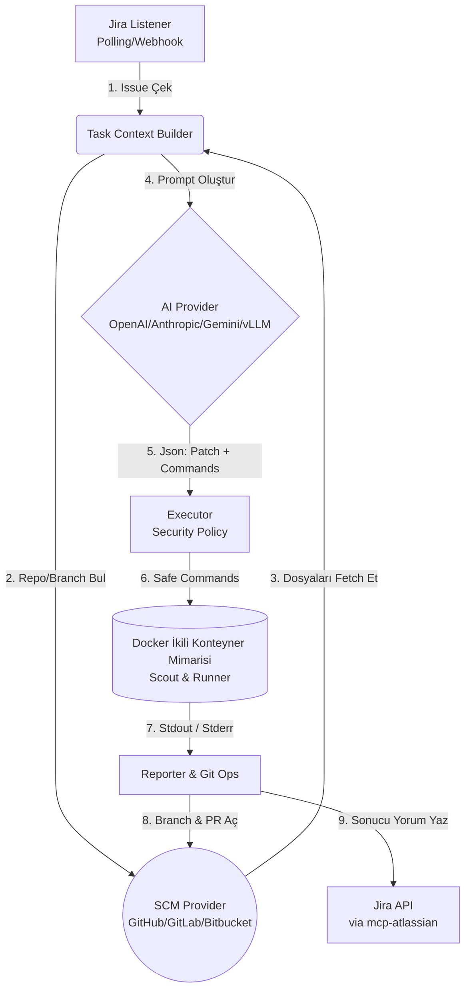

# AI Cyber Bot — MCP Jira Automation

**AI Cyber Bot**, Jira'daki görevleri otomatik olarak alan, kod depolarından (GitHub/GitLab/Bitbucket) ilgili dosyaları çeken, açık kaynak ve popüler YZ (OpenAI/Anthropic/Gemini/vLLM) modelleriyle analiz eden, oluşturulan değişiklikleri izole bir Docker ortamında test eden ve başarılıysa bir Pull Request (PR) açarak sonucu Jira'ya raporlayan **otonom bir yazılım geliştirme asistanıdır (AI Agent)**.

👉 **Teknik olmayan kullanıcılar için:** [🤖 Basit Kullanım Kılavuzu (BASIT_KULLANIM.md)](BASIT_KULLANIM.md)

Bu sistem, standart bir CI/CD aracı gibi değil, kararları AI tarafından verilen **dinamik bir yazılım mühendisliği otomasyon altyapısı** olarak tasarlanmıştır.

---

## 🏗️ Mimari ve Çalışma Mantığı



### Temel Özellikler
- **Idempotency & Retry**: Sistemin çökmesi durumunda aynı görev tekrar tekrar işlenmez (JSON tabanlı lock ve state yönetimi ile Retry/Backoff mekanizmaları).
- **Çift Konteynerli (Two-Container) İzole Test Ortamı**: 
  - **Scout Container (alpine/git):** Kodları güvenli bir şekilde klonlar ve projenin dilini/türünü (Node.js, Python, vb.) otomatik olarak algılar.
  - **Runner Container:** Alınan karara göre özel bir imaj (ör. `node:20-bookworm`) ayağa kaldırılır, AI'ın ürettiği komutlar ve testler dış dünyaya ve ana makineye zarar veremeyecek şekilde çalıştırılır (Read-only RootFS desteği dahil).
- **Güvenlik Politikası & Secret Audit**: `sudo`, `rm -rf /` gibi zararlı komutlar engellenir. Strict modda sadece `npm test`, `pytest`, `go test` vb. komutlara izin verilir. Ayrıca `.env` dosyasındaki gizli anahtarlar loglanmaz, sadece varlıkları (auditSecrets) kontrol edilir.
- **Onay Modu (`REQUIRE_APPROVAL=true`)**: AI doğrudan kod değiştirmek yerine önce planını Jira'ya yazar ve sizden onay (durum değişikliği) bekler.
- **Provider Bağımsız**: Tek `.env` ayarıyla GitHub'dan GitLab'a veya OpenAI'dan Anthropic'e geçiş yapabilirsiniz.
- **Tamamen Yerel Mod (vLLM)**: Kod güvenliği kritik ise şirket içi sunucularınızdaki açık kaynak modellerle (vLLM) dışarıya kod çıkarmadan çalışabilirsiniz.

---

## 🚀 Kurulum

### Ön Koşullar
1. [Node.js](https://nodejs.org/) (v20+)
2. [Docker](https://www.docker.com/) (İzole test ve proje analiz ortamı için şart)
3. Python 3 ve pip (Atlassian/Bitbucket MCP sunucuları için)

*(Daha kolay bir anlatım için [Basit Kullanım Kılavuzuna](BASIT_KULLANIM.md) bakabilirsiniz.)*

### 1. Jira Kurulumu
1. Jira ortamınızda **"AI Cyber Bot"** isimli (display name aynı olmalı) bir kullanıcı/bot hesabı oluşturun. Sistem sadece bu hesaba atanan görevleri dikkate alır.
2. Jira "Issues > Custom Fields" ayarlarından **"Repository"** adında `Short text (plain text)` formatında bir custom field oluşturun ve ekranlara (screens) ekleyin.
   - *Bu fieldın IDsini `.env` içindeki `JIRA_REPO_FIELD_ID` kısmına yazacaksınız.*

### 2. SCM (Kaynak Kod) Kurulumu
"Repository" field'ına aşağıdaki formatlarda değer girebilirsiniz:
- **GitHub**: `org/repo`
- **GitLab**: `group/repo` veya `group/subgroup/repo`
- **Bitbucket**: `workspace/repo`

*(Sistem, tam URL verseniz bile `https://github.com/org/repo` formatını parse edip doğru formata dönüştürür).*

### 3. Yapılandırma (`.env`)
Depoyu klonladıktan sonra:
```bash
cp .env.example .env
```
`.env` dosyasını açıp bilgileri doldurun (Dosya içindeki açıklamalar size rehberlik edecektir).

### 4. Çalıştırma

Projeyi derleyin ve çalıştırın:
```bash
npm install
npm run build
npm run dev
```

Veya **Docker Compose** ile arka planda izole olarak her şeyi başlatın:
```bash
docker-compose up -d
```

---

## ⚙️ Yapılandırma Rehberi (.env)

| Değişken | Açıklama |
|----------|----------|
| **Jira Ayarları** | |
| `JIRA_BASE_URL` | Jira sunucunuzun örneğin `https://sirket.atlassian.net` şeklindeki adresi. |
| `JIRA_API_TOKEN` | Jira API erişim bileti (Kişisel ayarlar > Security alanından oluşturulur). |
| `JIRA_REPO_FIELD_ID` | Eklediğiniz "Repository" isimli custom field'ın arka plandaki ID'si (ör. `customfield_10042`). |
| **SCM Seçimi** | |
| `SCM_PROVIDER` | `github`, `gitlab` veya `bitbucket`. Hangi ortam kullanılıyorsa onun token/şifre ayarlarını alt kısımdan doldurmanız gerekir. |
| **AI Seçimi** | |
| `AI_PROVIDER` | `openai`, `anthropic`, `gemini` veya `vllm`. |
| **ÖNEMLİ (vLLM)** | Eğer `vLLM` kullanıyorsanız, seçeceğiniz model **Mutlaka "Tool/Function Calling" desteklemelidir**. Önerilenler: `Qwen2.5-72B-Instruct`, `Llama-3.1-70B-Instruct`. |
| **Güvenlik & Executor** | |
| `EXEC_POLICY` | `strict` (Sadece whitelist) veya `permissive` (Tümü serbest, sadece blacklist engellenir). |
| `REQUIRE_APPROVAL` | `true` yapılırsa, kod pushlanıp test edilmeden önce rapor Jira'ya yazılıp insan onayı beklenir. |
| `ALLOW_INSTALL_SCRIPTS` | Docker içerisinde çalıştırılacak test komutlarından önce AI'nin npm install/pip install tarzı komutları kullanmasına izin verip vermeyeceğinizi belirler. |

---

## 🛠️ Nasıl Çalışır? (Bir Task'ın Yolculuğu)

1. Geliştirici, Jira'da yeni bir task açar. "Repository" custom field'ına `sirketim/backend-api` yazar.
2. Geliştirici, işin assignee kısmına **"AI Cyber Bot"** seçer.
3. Arka planda poller, bu değişikliği yakalar.
4. Bot, belirtilen SCM'e (Github/Gitlab) gidip o reponun kaynak ve test dosyalarını akıllı bir filtreyle (Context Builder) çekerek hazırlık yapar.
5. İstek YZ'ye gönderilir. YZ'den bir **patch (kod değişikliği) listesi ve test komut senaryosu** oluşturması istenir.
6. YZ'nin ürettiği kod değişiklikleri kaydedilir.
7. **Docker Executor** devreye girer:
   - **Scout aşaması:** Proje klonlanır ve `package.json`, `requirements.txt` gibi dosyalara bakılarak projenin tipi (Node, Python vb.) keşfedilir (Project Detection Sistemi).
   - **Main/Runner aşaması:** Belirlenen tipe uygun bir Docker Container (ör: `node:20-bookworm`) ayağa kaldırılır. YZ'nin ürettiği kodlar (patch) basılır ve bağımlılıklar kurulduktan sonra verilen test komutları tam izole şekilde çalıştırılır.
8. Eğer container'daki test **başarı ile (Exit Code 0)** biterse, SCM'de projeden bir otomatik branch açılır, değişiklikler commit'lenir ve Pull Request oluşturulur.
9. Jira'daki o task'a geçici Docker limitleri, stderr/stdout logları ve açılan PR bağlantısı yorum olarak yazılır, ticket Done'a taşınabilir. Eğer süreç başarısız olursa, hata analizi ve loglar ile birlikte Jira taskı güncellenir.

---

## Modüler Geliştirme (Ek Olarak)

- **Yeni AI Eklemek:** Sadece `src/ai/` altına `xyz.ts` ekleyip `AiProvider` arayüzünü kullanarak `index.ts` arrayine kaydetmeniz yeterlidir.
- **Yeni SCM Eklemek:** Sadece `src/scm/` altına yeni platformunuza ait MCP adapterini yazabilirsiniz.