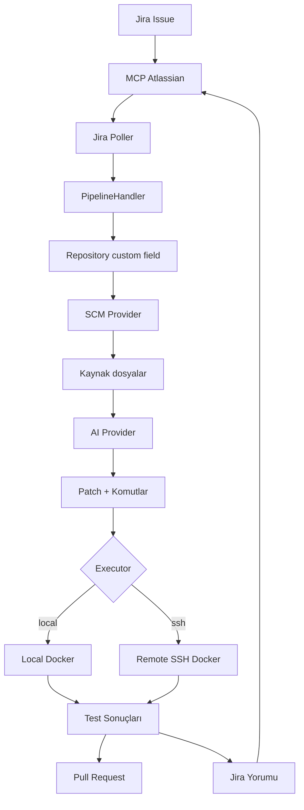

# MCP Jira Automation

Jira issue'larını okuyup ilgili repo'dan kaynak kodu çeken, AI ile test üretip Docker'da çalıştıran ve sonucu PR + Jira yorumu olarak raporlayan otomasyon servisi.

## Mimari

```
mcp-atlassian (bağımsız servis, port 9000)
    └── mcp-jira-automation (bu proje)
```



## Gereksinimler

- Node.js 20+
- Docker (local executor için)
- Bitbucket / GitHub / GitLab erişim token'ı
- `mcp-atlassian` servisi (ayrı çalışır)
- AI provider credentials (OpenAI, Anthropic, Gemini, vLLM) veya Aider CLI

## Kurulum

```bash
npm install
npm run build
npm install -g .   # mja komutunu PATH'e ekler
```

Konfigürasyon dosyalarını oluştur:

```bash
cp .env.example .env
cp mcp-atlassian.env.example mcp-atlassian.env
```

`.env` ve `mcp-atlassian.env` dosyalarını düzenle.

## Çalıştırma

**Terminal 1 — MCP Atlassian:**

> Kurulum ve detaylar: [github.com/sooperset/mcp-atlassian](https://github.com/sooperset/mcp-atlassian)

```bash
cd /path/to/mcp-atlassian
uv run mcp-atlassian --transport streamable-http --host 0.0.0.0 --port 9000 --path /mcp
```

> `UV_ENV_FILE` ortam değişkenini kalıcı olarak set edersen `--env-file` parametresine gerek kalmaz:
> ```powershell
> [Environment]::SetEnvironmentVariable("UV_ENV_FILE", "C:\path\to\mcp-atlassian.env", "User")
> ```

**Terminal 2 — Uygulama:**

```bash
mja app
```

**CLI komutları:**

```bash
mja app    # Uygulamayı başlat (MCP ayrıca çalışıyor olmalı)
mja help   # Yardım
```

## Jira Workflow

Servis, JQL ile eşleşen issue'ları poll eder. Varsayılan JQL `JQL_ASSIGNED_TO_BOT` ile override edilebilir.

### Repository Belirleme

Hedef repo şu kaynaklardan okunur (öncelik sırasıyla):

1. Jira `Repository` custom field'ı
2. Issue description'da `Repository: owner/repo` satırı
3. Issue description'da GitHub/GitLab/Bitbucket URL'i

### Issue Description Örneği

```
Repository: ahmet/example-api

base_url: https://staging.example.com

Auth endpointlerini test et:
- POST /api/auth/register
- POST /api/auth/login
- GET /api/auth/profile
```

### Per-Issue Overrides

| Alan | Açıklama |
|------|----------|
| `base_url: https://...` | Bu issue için hedef API URL'i. Remote modu implicitly aktif eder. |
| `execution_mode: remote` | Testleri dış API'ye karşı çalıştır. |
| `execution_mode: sandbox` | Backend'i Docker'da başlatıp yerel test et. |

### Per-Issue Prompt Override

Issue description'ına `[PROMPT]...[/PROMPT]` bloğu ekleyerek AI'a özel talimat verebilirsin:

```
Repository: ahmet/example-api

[PROMPT]
Sadece /auth endpointlerini test et.
Test yorumlarını Türkçe yaz.
[/PROMPT]
```

## Prompt Özelleştirme

AI'ın kullandığı sistem prompt'u üç seviyede özelleştirilebilir:

| Seviye | Yöntem | Kapsam |
|--------|--------|--------|
| Global | `prompts/custom.md` dosyası oluştur | Tüm issue'lar |
| Global | `.env`'e `CUSTOM_PROMPT_FILE=/path/to/prompt.md` ekle | Tüm issue'lar |
| Per-issue | Description'a `[PROMPT]...[/PROMPT]` ekle | Tek issue |

`prompts/custom.md.example` dosyasını başlangıç noktası olarak kullanabilirsin.

## Execution Modes

### Remote Mode

Halihazırda çalışan bir API'ye karşı test üretir. Bağımlılık kurulumu veya backend başlatma yapmaz.

```env
EXECUTION_MODE=remote
API_BASE_URL=https://staging-api.example.com
```

API base URL öncelik sırası:
1. Jira custom field veya description'daki `base_url`
2. `.env`'deki `API_BASE_URL`
3. README'den otomatik tespit

### Sandbox Mode

Repo'yu Docker'a klonlar, proje tipini tespit eder, bağımlılıkları kurar, backend ve veritabanı servislerini başlatır.

```env
EXECUTION_MODE=sandbox
```

## Executor Backends

### Local

Docker aynı makinede çalışır.

```env
EXECUTOR_BACKEND=local
```

### SSH

Docker uzak makinede çalışır.

```env
EXECUTOR_BACKEND=ssh
SSH_HOST=192.0.2.10
SSH_PORT=22
SSH_USER=ubuntu
SSH_PRIVATE_KEY_PATH=/home/user/.ssh/id_rsa
SSH_REMOTE_WORKDIR=/opt/mcp-jira-automation/workspaces
SSH_CLEANUP_WORKSPACE=true
SSH_REMOVE_IMAGE=false
```

## AI Providers

```env
AI_PROVIDER=openai    # openai | anthropic | gemini | vllm | aider
AI_MODEL=gpt-4o
```

Aider için:

```env
AI_PROVIDER=aider
AIDER_MODEL=gpt-4o
AIDER_PATH=aider
OPENAI_API_KEY=sk-...
```

## Konfigürasyon Referansı

### .env

| Değişken | Açıklama |
|----------|----------|
| `JIRA_BASE_URL` | Jira base URL |
| `JIRA_EMAIL` | Jira hesap e-postası |
| `JIRA_API_TOKEN` | Jira API token'ı |
| `JIRA_PROJECT_KEY` | Jira proje anahtarı |
| `JIRA_AI_BOT_DISPLAY_NAME` | Bot kullanıcısının Jira görünen adı |
| `JIRA_REPO_FIELD_ID` | Repository custom field ID (opsiyonel, otomatik tespit edilir) |
| `JIRA_CREDENTIALS_FIELD_ID` | Credentials custom field ID (opsiyonel) |
| `JIRA_BASE_URL_FIELD_ID` | Base URL custom field ID (opsiyonel) |
| `JQL_ASSIGNED_TO_BOT` | JQL override (opsiyonel) |
| `MODE` | `poll` veya `webhook` |
| `POLL_INTERVAL_MS` | Poll aralığı (ms) |
| `SCM_PROVIDER` | `github`, `gitlab`, veya `bitbucket` |
| `GITHUB_TOKEN` | GitHub erişim token'ı |
| `GITLAB_TOKEN` | GitLab erişim token'ı |
| `BITBUCKET_EMAIL` | Bitbucket hesap e-postası |
| `BITBUCKET_API_TOKEN` | Bitbucket API token'ı |
| `BITBUCKET_USERNAME` | Bitbucket kullanıcı adı |
| `AI_PROVIDER` | `openai`, `anthropic`, `gemini`, `vllm`, veya `aider` |
| `AI_MODEL` | Model adı |
| `AIDER_MODEL` | Aider model adı |
| `AIDER_PATH` | Aider executable yolu |
| `EXECUTION_MODE` | `remote` veya `sandbox` |
| `API_BASE_URL` | Remote mod için hedef API URL'i |
| `EXECUTOR_BACKEND` | `local` veya `ssh` |
| `EXEC_POLICY` | `strict` veya `permissive` |
| `DOCKER_IMAGE` | `auto` veya belirli bir Docker image |
| `EXEC_TIMEOUT_MS` | Test execution timeout (ms) |
| `ALLOW_INSTALL_SCRIPTS` | Bağımlılık kurulum scriptlerine izin ver |
| `SSH_HOST` | SSH executor için uzak host |
| `SSH_PORT` | SSH portu |
| `SSH_USER` | SSH kullanıcı adı |
| `SSH_PRIVATE_KEY_PATH` | SSH private key yolu |
| `SSH_REMOTE_WORKDIR` | Uzak workspace kök dizini |
| `SSH_CONNECT_TIMEOUT_MS` | SSH bağlantı timeout (ms) |
| `SSH_CLEANUP_WORKSPACE` | Execution sonrası workspace'i sil |
| `SSH_REMOVE_IMAGE` | Execution sonrası Docker image'ı sil |
| `CONTAINER_TEST_ENV` | Test container'ı için env override'ları (virgülle ayrılmış KEY=VALUE) |
| `REQUIRE_APPROVAL` | Execution öncesi onay bekle |
| `MCP_URL` | MCP Atlassian URL'i |
| `MCP_TRANSPORT` | `sse` veya `streamable-http` |
| `CUSTOM_PROMPT_FILE` | Özel sistem prompt dosyası yolu |
| `LOG_LEVEL` | `debug`, `info`, `warn`, `error`, veya `silent` |
| `STATE_FILE` | Kalıcı state dosyası yolu |
| `MAX_ATTEMPTS` | Başarısız issue'lar için maksimum deneme sayısı |

### mcp-atlassian.env

| Değişken | Açıklama |
|----------|----------|
| `JIRA_URL` | Jira instance URL'i |
| `JIRA_USERNAME` | Jira e-posta adresi |
| `JIRA_API_TOKEN` | Jira API token'ı |
| `CONFLUENCE_URL` | Confluence URL'i (opsiyonel) |
| `CONFLUENCE_USERNAME` | Confluence e-posta adresi (opsiyonel) |
| `CONFLUENCE_API_TOKEN` | Confluence API token'ı (opsiyonel) |
| `TRANSPORT` | `streamable-http` veya `sse` |
| `PORT` | MCP sunucu portu |
| `HOST` | MCP sunucu host'u |
| `TOOLSETS` | Aktif toolset'ler |
| `FASTMCP_LOG_LEVEL` | FastMCP log seviyesi |

## Geliştirme

```bash
npm run build
npm run lint
npm test
```

## Bilinen Kısıtlamalar

- SSH backend şu an remote API testine odaklanır. Local sandbox backend ile tam parite (veritabanı, backend lifecycle) henüz mevcut değil.
- AI üretilen testler route parametreleri veya auth hakkında yanlış varsayımlar yapabilir. Başarısız sonuçlar Jira ve PR'da görünür.
- Testler başarısız olsa bile PR oluşturulabilir — bu kasıtlıdır, inceleme için.
