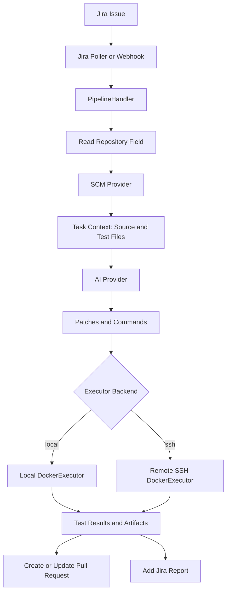

# MCP Jira Automation

MCP Jira Automation is a Jira-driven automation service that reads assigned issues, collects focused repository context, generates tests or patches with an AI provider, executes the generated commands in Docker, and reports the result back through a pull request and a Jira comment.

The current runtime architecture is centered on `PipelineHandler`, AI providers, executor backends, and Jira reporting.

## Architecture



## Core Components

- `src/app.ts`: Wires MCP, Jira, SCM, AI, state, and pipeline services.
- `src/pipeline/handler.ts`: Orchestrates the lifecycle of a single Jira issue.
- `src/pipeline/context.ts`: Collects a bounded set of repository files from the configured SCM provider.
- `src/ai/*`: AI provider implementations for OpenAI, Anthropic, Gemini, vLLM, and Aider.
- `src/executor/index.ts`: Applies command policy filtering and selects the configured executor backend.
- `src/executor/docker.ts`: Runs generated tests in Docker on the local machine.
- `src/executor/ssh-docker.ts`: Runs generated tests in Docker on a remote machine over SSH.
- `src/pipeline/reporter.ts`: Formats execution results as Jira comments.
- `src/state/store.ts`: Provides issue locking, retry state, and idempotency.

`src/test-execution-reporting/` is a separate legacy or experimental reporting module. It is not used by the main Jira automation runtime, although it is still covered by tests and may be extracted or reintegrated later.

## Requirements

- Node.js 20 or newer
- Docker
- GitHub, GitLab, or Bitbucket access token
- MCP Atlassian server
- AI provider credentials, or Aider CLI when using `AI_PROVIDER=aider`
- For SSH execution:
  - SSH access to the remote machine
  - `git` installed on the remote machine
  - Docker installed on the remote machine
  - A remote user that can run Docker commands

## Installation

```bash
npm install
cp .env.example .env
cp mcp-atlassian.env.example mcp-atlassian.env
```

Configure `.env` and `mcp-atlassian.env` before starting the service.

On Windows, `mja run` first tries to use the project-local MCP executable:

```text
.venv-mcp/Scripts/mcp-atlassian.exe
```

If it is not available, the command falls back to `mcp-atlassian` from `PATH`.

## Running the Service

Build and link the CLI:

```bash
npm run build
npm link
```

Start all services:

```bash
mja run
```

Available commands:

```bash
mja run    # Start MCP Atlassian and the application
mja mcp    # Start only MCP Atlassian
mja app    # Start only the application
mja help   # Show CLI help
```

Manual startup:

```bash
mcp-atlassian --env-file mcp-atlassian.env --transport sse --port 9000
npm run dev
```

## Jira Workflow

The service polls Jira or receives webhooks, then processes issues that match the configured JQL. The default JQL targets issues assigned to the bot user, but it can be overridden with `JQL_ASSIGNED_TO_BOT`.

The target repository is resolved from one of the following sources:

1. The Jira `Repository` custom field
2. A `Repository: owner/repo` line in the issue description
3. A GitHub, GitLab, or Bitbucket URL in the issue description

Example issue description:

```markdown
Repository: ahmet/example-api

base_url: https://staging.example.com

Test the authentication endpoints:
- POST /api/auth/register
- POST /api/auth/login
- GET /api/auth/profile
```

Supported per-issue overrides:

| Field | Description |
| --- | --- |
| `base_url: https://...` | Sets the target API URL for this issue and implies remote execution mode. |
| `execution_mode: remote` | Runs tests against an external API. |
| `execution_mode: sandbox` | Attempts to start the backend in Docker and test it locally inside the executor environment. |

Precedence:

```text
execution_mode override > base_url presence > EXECUTION_MODE from .env
```

## Execution Modes

### Remote Mode

Remote mode runs generated tests against an already running API, such as a staging or development environment. It does not install application dependencies, start the backend, or start database services.

```env
EXECUTION_MODE=remote
API_BASE_URL=https://staging-api.example.com
```

The target API base URL is resolved in this order:

1. Jira custom field or `base_url` in the issue description
2. `API_BASE_URL` from `.env`
3. Automatic detection from the repository README

### Sandbox Mode

Sandbox mode clones the repository into Docker, detects the project type, installs dependencies when needed, and attempts to start the backend and supporting database services.

```env
EXECUTION_MODE=sandbox
```

The local Docker executor has the most complete sandbox support. The SSH executor currently focuses on remote API testing; full remote sandbox orchestration for databases and backend lifecycle can be added as a follow-up.

## Executor Backends

The executor backend controls where Docker commands are executed.

### Local Backend

The default backend runs Docker on the same machine as the bot.

```env
EXECUTOR_BACKEND=local
```

### SSH Backend

The SSH backend connects to a remote machine and runs repository cloning, patch upload, Docker test execution, artifact collection, and cleanup there.

```env
EXECUTOR_BACKEND=ssh
SSH_HOST=192.0.2.10
SSH_PORT=22
SSH_USER=ubuntu
SSH_PRIVATE_KEY_PATH=C:\Users\you\.ssh\id_rsa
SSH_REMOTE_WORKDIR=/opt/mcp-jira-automation/workspaces
SSH_CLEANUP_WORKSPACE=true
SSH_REMOVE_IMAGE=false
```

SSH backend flow:

1. Create a unique workspace under `SSH_REMOTE_WORKDIR`.
2. Clone the target repository on the remote machine.
3. Write AI-generated patches into the remote workspace.
4. Run the generated commands in a Docker container on the remote machine.
5. Capture changed files and generated test results.
6. Remove the container.
7. Remove the remote workspace when `SSH_CLEANUP_WORKSPACE=true`.
8. Remove the Docker image when `SSH_REMOVE_IMAGE=true`.

Operational notes:

- The remote user must be able to run Docker.
- `SSH_REMOVE_IMAGE=true` saves disk space but slows down subsequent runs.
- `SSH_REMOTE_WORKDIR` must be an absolute POSIX path.
- Store only the private key path in `.env`; do not store private key contents.

## AI Providers

Supported AI providers:

```env
AI_PROVIDER=openai
AI_MODEL=gpt-4o
```

Allowed values:

```text
openai | anthropic | gemini | vllm | aider
```

Aider configuration:

```env
AI_PROVIDER=aider
AIDER_MODEL=gpt-4o
AIDER_PATH=aider
OPENAI_API_KEY=sk-...
```

Aider is used as an external code generation tool. It receives a focused workspace and returns generated files or modifications plus commands to execute.

## Command Policy

AI-generated commands are filtered by `src/executor/policy.ts` before execution.

```env
EXEC_POLICY=strict
```

In `strict` mode, only allowlisted test and build commands are executed. Shell operators and risky commands are blocked.

## Configuration Reference

| Variable | Description |
| --- | --- |
| `JIRA_BASE_URL` | Jira base URL. |
| `JIRA_EMAIL` | Jira account email. |
| `JIRA_API_TOKEN` | Jira API token. |
| `JIRA_PROJECT_KEY` | Jira project key. |
| `JIRA_AI_BOT_DISPLAY_NAME` | Jira display name of the bot user. |
| `JIRA_REPO_FIELD_ID` | Repository custom field ID. Optional; auto-detected when possible. |
| `JIRA_CREDENTIALS_FIELD_ID` | Credentials custom field ID. Optional. |
| `JIRA_BASE_URL_FIELD_ID` | Base URL custom field ID. Optional. |
| `JQL_ASSIGNED_TO_BOT` | Optional Jira search JQL override. |
| `MODE` | Listener mode: `poll` or `webhook`. |
| `POLL_INTERVAL_MS` | Poll interval in milliseconds. |
| `WEBHOOK_PORT` | Webhook HTTP port. |
| `WEBHOOK_SECRET` | Optional HMAC secret for webhook verification. |
| `SCM_PROVIDER` | `github`, `gitlab`, or `bitbucket`. |
| `GITHUB_TOKEN` | GitHub access token. |
| `GITLAB_TOKEN` | GitLab access token. |
| `GITLAB_URL` | GitLab base URL. |
| `BITBUCKET_EMAIL` | Atlassian account email for Bitbucket API token authentication. |
| `BITBUCKET_API_TOKEN` | Bitbucket API token with repository and pull request scopes. |
| `BITBUCKET_USERNAME` | Bitbucket username/workspace slug, used for Git operations and repository references. |
| `BITBUCKET_APP_PASSWORD` | Deprecated Bitbucket app password fallback for older accounts. |
| `AI_PROVIDER` | `openai`, `anthropic`, `gemini`, `vllm`, or `aider`. |
| `AI_MODEL` | Model name for non-Aider providers. |
| `AIDER_MODEL` | Model used by Aider. |
| `AIDER_PATH` | Path to the Aider executable. |
| `EXECUTION_MODE` | `remote` or `sandbox`. |
| `API_BASE_URL` | Target API URL for remote mode. |
| `EXECUTOR_BACKEND` | `local` or `ssh`. |
| `EXEC_POLICY` | `strict` or `permissive`. |
| `DOCKER_IMAGE` | `auto` or a specific Docker image. |
| `EXEC_TIMEOUT_MS` | Test execution timeout in milliseconds. |
| `ALLOW_INSTALL_SCRIPTS` | Allows dependency install scripts when supported by the executor. |
| `SSH_HOST` | Remote host for SSH executor. |
| `SSH_PORT` | SSH port. |
| `SSH_USER` | SSH username. |
| `SSH_PRIVATE_KEY_PATH` | Path to the SSH private key. |
| `SSH_REMOTE_WORKDIR` | Remote workspace root directory. |
| `SSH_CONNECT_TIMEOUT_MS` | SSH connection timeout in milliseconds. |
| `SSH_CLEANUP_WORKSPACE` | Whether to delete the remote workspace after execution. |
| `SSH_REMOVE_IMAGE` | Whether to delete the Docker image after execution. |
| `CONTAINER_TEST_ENV` | Comma-separated environment variable overrides for test containers. |
| `REQUIRE_APPROVAL` | Whether to wait for approval before execution. |
| `MCP_SSE_URL` | MCP Atlassian SSE URL. |
| `LOG_LEVEL` | `debug`, `info`, `warn`, `error`, or `silent`. |
| `STATE_FILE` | Path to the persistent state file. |
| `MAX_ATTEMPTS` | Maximum retry attempts for failed issues. |

## Development

```bash
npm run build
npm run lint
npm test
```

Targeted test run:

```bash
npx vitest run tests/config.test.ts tests/policy.test.ts tests/sanitize.test.ts
```

## Known Limitations

- The SSH backend currently focuses on remote API testing. It does not yet provide full parity with the local sandbox backend for database and backend lifecycle orchestration.
- AI-generated tests may still make incorrect assumptions about route parameters, authentication, or live API behavior. Failed test results are preserved in Jira and in the pull request for review.
- A pull request may be created even when tests fail. This is intentional so reviewers can inspect the generated test files and execution report.
