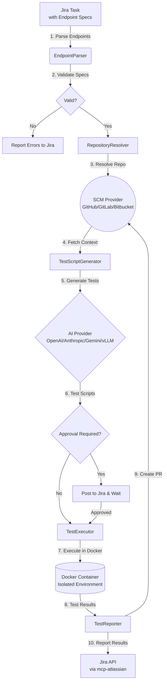

# AI Cyber Bot — API Testing Automation

**AI Cyber Bot** is an **autonomous API testing system** that automatically retrieves API endpoint specifications from Jira tasks, generates comprehensive test scripts using AI models (OpenAI/Anthropic/Gemini/vLLM), executes tests in isolated Docker environments, and reports results back to Jira with pull requests containing the generated tests.

This system transforms API endpoint specifications into production-ready test suites, supporting multiple test frameworks (pytest, Jest, Postman) and endpoint specification formats (JSON, YAML, Markdown tables).

---

## 🏗️ Architecture and Working Logic



### Key Features
- **Endpoint Specification Parsing**: Supports JSON, YAML, and Markdown table formats for defining API endpoints in Jira tasks.
- **AI-Powered Test Generation**: Automatically generates comprehensive test suites including functional tests, status code validation, schema validation, authentication tests, and edge cases.
- **Framework Detection**: Automatically detects and uses the appropriate test framework (pytest with requests, Jest with axios, or Postman collections).
- **Isolated Test Execution**: Tests run in ephemeral Docker containers with timeout protection and resource limits.
- **Approval Workflow**: Optional review gate where generated tests can be reviewed before execution (`REQUIRE_APPROVAL=true`).
- **Comprehensive Test Types**: Generates functional tests, status code tests, response body validation, schema validation, input validation, authentication tests, CRUD workflows, edge cases, and regression tests.
- **Automatic PR Creation**: Generated test scripts are committed to a branch and opened as a pull request with detailed test results.
- **Provider Independent**: Switch between GitHub/GitLab/Bitbucket and OpenAI/Anthropic/Gemini/vLLM with simple configuration.
- **Idempotency & Retry**: Exponential backoff and state management prevent duplicate processing and handle transient failures.

---

## 🚀 Installation

### Prerequisites
1. [Node.js](https://nodejs.org/) (v20+)
2. [Docker](https://www.docker.com/) (Required for isolated test and project analysis environment)
3. Python 3 and pip (For Atlassian/Bitbucket MCP servers)

### 0. MCP Atlassian Setup (IMPORTANT!)
This project uses the MCP Atlassian server to communicate with Jira. You need to install it first:

```bash
# Install MCP Atlassian
pip install mcp-atlassian

# Copy the mcp-atlassian.env.example file
cp mcp-atlassian.env.example mcp-atlassian.env

# Edit the mcp-atlassian.env file and enter your Jira information
# Fill in JIRA_URL, JIRA_USERNAME, JIRA_API_TOKEN values
```

**Note:** The `PORT=9000` value in the `mcp-atlassian.env` file must match `MCP_SSE_URL=http://127.0.0.1:9000/sse` in the `.env` file.

For detailed setup: [MCP-ATLASSIAN-SETUP.md](MCP-ATLASSIAN-SETUP.md)

### 1. Jira Setup
1. Create a user/bot account named **"AI Cyber Bot"** (display name must be the same) in your Jira environment. The system only considers tasks assigned to this account.
2. Create a custom field named **"Repository"** in `Short text (plain text)` format from Jira "Issues > Custom Fields" settings and add it to screens.
   - *You will write this field's ID in the `JIRA_REPO_FIELD_ID` section in `.env`.*
   - Alternatively, you can write in task description in format: `Repository: username/repo`

For detailed guide: [JIRA-REPOSITORY-GUIDE.md](JIRA-REPOSITORY-GUIDE.md)

### 2. SCM (Source Code) Setup
You can enter values in the "Repository" field in the following formats:
- **GitHub**: `org/repo`
- **GitLab**: `group/repo` or `group/subgroup/repo`
- **Bitbucket**: `workspace/repo`

*(Even if you provide a full URL, the system parses the `https://github.com/org/repo` format and converts it to the correct format).*

### 3. Configuration (`.env`)
After cloning the repository:
```bash
cp .env.example .env
```
Open the `.env` file and fill in the information (Comments in the file will guide you).

### 4. Running

#### Option 1: Automatic Startup (Windows - Recommended)
The `start-all.bat` file automatically starts both the MCP Atlassian server and the main application:
```bash
.\scripts\start-all.bat
```

This command opens two separate windows:
1. MCP Atlassian server (port 9000)
2. Main application

**Alternative:** If you want to start them separately:
```bash
# Terminal 1: MCP Atlassian
.\scripts\start-mcp-only.bat

# Terminal 2: Main Application (after MCP Atlassian starts)
.\scripts\start-app-only.bat
```

#### Option 2: Linux/Mac
```bash
# Make scripts executable (first time only)
chmod +x scripts/*.sh

# Start everything
./scripts/start-all.sh

# Or start separately
./scripts/start-mcp-only.sh     # MCP Atlassian only
./scripts/start-app-only.sh     # Main app only
```

#### Option 3: Manual Startup
Open two separate terminals:

**Terminal 1 - MCP Atlassian:**
```bash
# Using PowerShell
.\scripts\start-mcp-atlassian.ps1

# or direct command
mcp-atlassian --env-file mcp-atlassian.env --transport sse --port 9000 -vv
```

**Terminal 2 - Main Application:**
```bash
npm install
npm run build
npm run dev
```

#### Option 4: Docker Compose
Start everything in the background in isolation with **Docker Compose**:
```bash
docker-compose up -d
```

**Note:** If you use Docker Compose, MCP Atlassian is automatically started and configured.

---

## 🧪 Quick Test

### Step 1: Prepare Repository
Use your own repository or fork a test repository that contains an API you want to test.

### Step 2: Create Jira Task with Endpoint Specifications

You can specify API endpoints in three formats:

#### Format 1: JSON
```
Summary: Test User API Endpoints

Description:
Test the user management API endpoints.

Endpoints:
```json
[
  {
    "url": "https://api.example.com/users",
    "method": "GET",
    "expectedStatus": 200,
    "authType": "Bearer",
    "testScenarios": ["success", "unauthorized"]
  },
  {
    "url": "https://api.example.com/users",
    "method": "POST",
    "expectedStatus": 201,
    "authType": "Bearer",
    "requestBody": {
      "firstName": "John",
      "lastName": "Doe",
      "email": "john@example.com"
    },
    "testScenarios": ["success", "validation_error", "unauthorized"]
  }
]
```

Repository: YOUR_USERNAME/YOUR_REPO
```

#### Format 2: YAML
```
Summary: Test User API Endpoints

Description:
Test the user management API endpoints.

Endpoints:
```yaml
- url: https://api.example.com/users
  method: GET
  expectedStatus: 200
  authType: Bearer
  testScenarios:
    - success
    - unauthorized

- url: https://api.example.com/users
  method: POST
  expectedStatus: 201
  authType: Bearer
  requestBody:
    firstName: John
    lastName: Doe
    email: john@example.com
  testScenarios:
    - success
    - validation_error
    - unauthorized
```

Repository: YOUR_USERNAME/YOUR_REPO
```

#### Format 3: Markdown Table
```
Summary: Test User API Endpoints

Description:
Test the user management API endpoints.

| Method | URL | Expected Status | Auth Type | Test Scenarios |
|--------|-----|-----------------|-----------|----------------|
| GET | https://api.example.com/users | 200 | Bearer | success, unauthorized |
| POST | https://api.example.com/users | 201 | Bearer | success, validation_error, unauthorized |
| GET | https://api.example.com/users/{id} | 200 | Bearer | success, not_found, unauthorized |
| PUT | https://api.example.com/users/{id} | 200 | Bearer | success, validation_error, not_found |
| DELETE | https://api.example.com/users/{id} | 204 | Bearer | success, not_found, unauthorized |

Repository: YOUR_USERNAME/YOUR_REPO
```

### Step 3: Set Assignee
Assign the task to **"AI Cyber Bot"** user.

### Step 4: Start System and Wait
```bash
.\scripts\start-all.bat
```

The bot will detect the task within 15-30 seconds and start processing. Monitor the logs:
```
INFO - Found 1 issue: KAN-XXX
INFO - Processing issue KAN-XXX
INFO - Parsing endpoint specifications...
INFO - Found 5 endpoints to test
INFO - Repository: YOUR_USERNAME/YOUR_REPO
INFO - Fetching repository context...
INFO - Detected test framework: pytest
INFO - Generating comprehensive test suite...
INFO - Starting Docker executor...
INFO - Tests passed! (15/15 tests)
INFO - Creating Pull Request...
✅ Issue KAN-XXX completed successfully
```

### What Gets Generated

The system generates comprehensive test suites including:
- **Functional Tests**: Verify endpoint behavior (GET /users, POST /login, etc.)
- **Status Code Tests**: Validate correct HTTP status codes (200, 201, 400, 401, 404, etc.)
- **Response Body Tests**: Verify JSON content structure and field values
- **Schema Validation Tests**: Ensure response JSON conforms to defined schemas
- **Input Validation Tests**: Verify error handling for missing fields, wrong types, empty data
- **Authentication Tests**: Token-based access, no-token scenarios, invalid token handling
- **CRUD Tests**: Verify Create → Read → Update → Delete workflows
- **Edge Case Tests**: Invalid IDs, excessively long strings, null values
- **Regression Tests**: Verify existing endpoints remain functional

For detailed test guide: [QUICK-START.md](QUICK-START.md)

---

## ⚙️ Configuration Guide (.env)

| Variable | Description |
|----------|----------|
| **Jira Settings** | |
| `JIRA_BASE_URL` | Your Jira server address, e.g., `https://company.atlassian.net`. |
| `JIRA_API_TOKEN` | Jira API access token (Created from Personal settings > Security). |
| `JIRA_REPO_FIELD_ID` | Backend ID of the "Repository" custom field you added (e.g., `customfield_10042`). Optional - can also read from description. |
| **SCM Selection** | |
| `SCM_PROVIDER` | `github`, `gitlab`, or `bitbucket`. You need to fill in the token/password settings for whichever environment is used. |
| **AI Selection** | |
| `AI_PROVIDER` | `openai`, `anthropic`, `gemini`, or `vllm`. |
| **IMPORTANT (vLLM)** | If using `vLLM`, the model you choose **Must support "Tool/Function Calling"**. Recommended: `Qwen2.5-72B-Instruct`, `Llama-3.1-70B-Instruct`. |
| **API Testing Configuration** | |
| `REQUIRE_APPROVAL` | If set to `true`, generated tests are posted to Jira for review before execution. |
| `TEST_TIMEOUT_SECONDS` | Maximum time allowed for test execution (default: 300 seconds). |
| `TEST_RETRY_COUNT` | Number of retry attempts for transient failures (default: 3). |
| `DEFAULT_TEST_FRAMEWORK` | Default test framework when auto-detection fails (`pytest`, `jest`, or `postman`). |

---

## 📝 Endpoint Specification Format

### Supported Fields

| Field | Type | Required | Description |
|-------|------|----------|-------------|
| `url` | string | Yes | Full URL or path of the endpoint |
| `method` | string | Yes | HTTP method: GET, POST, PUT, DELETE, PATCH |
| `expectedStatus` | number | Yes | Expected HTTP status code (200, 201, 400, etc.) |
| `authType` | string | No | Authentication type: Bearer, Basic, ApiKey, OAuth2 |
| `headers` | object | No | Custom request headers |
| `requestBody` | object | No | Request payload for POST/PUT/PATCH |
| `expectedResponseSchema` | object | No | JSON schema for response validation |
| `testScenarios` | array | No | Scenarios to test: success, unauthorized, not_found, validation_error, etc. |
| `performanceThresholdMs` | number | No | Maximum acceptable response time in milliseconds |

### Example: Complete Endpoint Specification

```json
{
  "url": "https://api.example.com/users",
  "method": "POST",
  "expectedStatus": 201,
  "authType": "Bearer",
  "headers": {
    "Content-Type": "application/json"
  },
  "requestBody": {
    "firstName": "John",
    "lastName": "Doe",
    "email": "john@example.com"
  },
  "expectedResponseSchema": {
    "type": "object",
    "properties": {
      "id": { "type": "string" },
      "firstName": { "type": "string" },
      "lastName": { "type": "string" },
      "email": { "type": "string", "format": "email" }
    },
    "required": ["id", "firstName", "lastName", "email"]
  },
  "testScenarios": [
    "success",
    "validation_error",
    "unauthorized",
    "duplicate_email"
  ],
  "performanceThresholdMs": 500
}
```

### Available Test Scenarios

When specifying `testScenarios` in your endpoint specifications, you can use:

- **success**: Happy path with valid data and authentication
- **unauthorized**: Request without authentication token
- **forbidden**: Request with valid token but insufficient permissions
- **not_found**: Request for non-existent resource (404)
- **validation_error**: Request with invalid or missing required fields (400)
- **duplicate**: Attempt to create duplicate resource (409)
- **rate_limit**: Test rate limiting behavior (429)
- **server_error**: Simulate server error scenarios (500)
- **timeout**: Test timeout handling
- **invalid_token**: Request with malformed or expired token
- **missing_fields**: Request with missing required fields
- **wrong_types**: Request with incorrect data types
- **empty_data**: Request with empty strings or null values
- **boundary_values**: Test with minimum/maximum allowed values
- **special_characters**: Test with special characters in input

---

## 🛠️ How Does It Work? (A Task's Journey)

1. Developer creates a new task in Jira with API endpoint specifications in JSON, YAML, or Markdown table format.
2. Developer writes `company/backend-api` in the "Repository" custom field (or in description).
3. Developer selects **"AI Cyber Bot"** as the assignee.
4. In the background, the poller catches this change.
5. **EndpointParser** parses and validates the endpoint specifications from the task description.
   - If validation fails, errors are posted to Jira with specific details about what's wrong.
6. **RepositoryResolver** extracts repository information and resolves the SCM provider (GitHub/GitLab/Bitbucket).
7. **TestScriptGenerator** fetches repository context:
   - Existing test files for reference
   - API specifications (OpenAPI/Swagger if available)
   - Configuration files (package.json, requirements.txt, etc.)
   - Detects the appropriate test framework (pytest, Jest, Postman)
8. AI generates comprehensive test scripts including:
   - Functional tests for each endpoint
   - Status code validation
   - Response schema validation
   - Authentication tests
   - Input validation tests
   - Edge case tests
   - CRUD workflow tests
9. If `REQUIRE_APPROVAL=true`, generated tests are posted to Jira for review. Otherwise, proceed to execution.
10. **TestExecutor** creates an ephemeral Docker container:
    - Clones the repository
    - Injects generated test scripts
    - Installs dependencies
    - Executes tests with timeout protection
    - Captures test results and output
11. **TestReporter** processes results:
    - Creates a new branch: `api-tests/{jira-key}`
    - Commits generated test scripts
    - Opens a Pull Request with test results
    - Posts formatted test results to Jira as a comment
    - Adds appropriate labels: `tests-passed`, `test-failed`, or `permanently-failed`
12. Developer reviews the PR, merges the tests, and closes the Jira task.

---

## 📚 Documentation

- **[QUICK-START.md](QUICK-START.md)** - Quick start guide for API testing
- **[MCP-ATLASSIAN-SETUP.md](MCP-ATLASSIAN-SETUP.md)** - MCP Atlassian setup guide
- **[JIRA-REPOSITORY-GUIDE.md](JIRA-REPOSITORY-GUIDE.md)** - Jira repository configuration guide
- **[scripts/README.md](scripts/README.md)** - Startup scripts documentation
- **[API-TESTING-GUIDE.md](API-TESTING-GUIDE.md)** - Comprehensive API testing workflow guide

---

## 🔧 Modular Development

- **Adding New AI:** Just add `xyz.ts` under `src/ai/` and register it in the `index.ts` array using the `AiProvider` interface.
- **Adding New SCM:** Just write the MCP adapter for your new platform under `src/scm/`.
- **Adding New Test Framework:** Extend `TestScriptGenerator` to support additional frameworks beyond pytest, Jest, and Postman.
- **Custom Endpoint Parsers:** Add support for additional specification formats (e.g., OpenAPI, Swagger) in `EndpointParser`.

---

## 🎯 Use Cases

### API Development Teams
- Automatically generate test suites for new API endpoints
- Ensure consistent test coverage across all endpoints
- Validate API contracts and response schemas
- Catch breaking changes early with regression tests

### QA Engineers
- Reduce manual test writing effort
- Generate comprehensive test scenarios automatically
- Test authentication and authorization flows
- Validate error handling and edge cases

### DevOps Teams
- Integrate API testing into CI/CD pipelines
- Monitor API health with automated test execution
- Track test results and coverage in Jira
- Maintain test scripts in version control via PRs

---

## 📊 Test Result Reporting

Test results are posted to Jira with detailed information:

```
✅ API Tests Completed Successfully

Test Summary:
- Total Tests: 15
- Passed: 15
- Failed: 0
- Duration: 12.3 seconds

Test Details:
✅ test_get_users_success (0.5s)
✅ test_get_users_unauthorized (0.3s)
✅ test_post_user_success (0.8s)
✅ test_post_user_validation_error (0.4s)
✅ test_post_user_duplicate_email (0.6s)
...

Pull Request: https://github.com/org/repo/pull/123
Branch: api-tests/KAN-456
```

---

## 📄 License

This project is licensed under the MIT License. See the [LICENSE](LICENSE) file for details.
