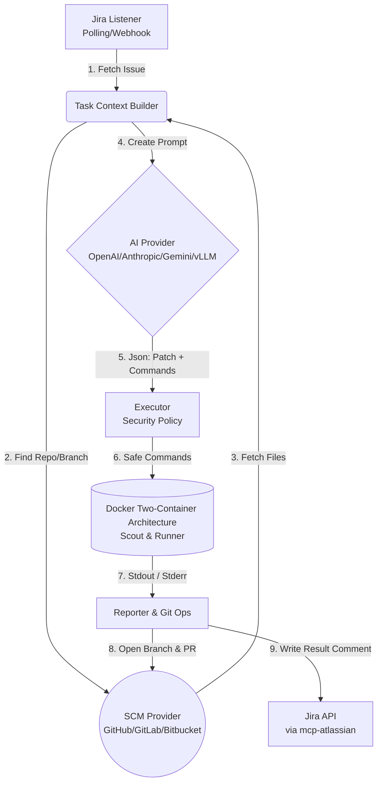

# AI Cyber Bot — MCP Jira Automation

**AI Cyber Bot** is an **autonomous software development assistant (AI Agent)** that automatically retrieves tasks from Jira, fetches relevant files from code repositories (GitHub/GitLab/Bitbucket), analyzes them with open-source and popular AI models (OpenAI/Anthropic/Gemini/vLLM), tests generated changes in an isolated Docker environment, and if successful, opens a Pull Request (PR) and reports the result back to Jira.

This system is designed not as a standard CI/CD tool, but as a **dynamic software engineering automation infrastructure** where decisions are made by AI.

---

## 🏗️ Architecture and Working Logic



### Key Features
- **Idempotency & Retry**: In case of system crash, the same task is not processed repeatedly (Retry/Backoff mechanisms with JSON-based lock and state management).
- **Two-Container Isolated Test Environment**: 
  - **Scout Container (alpine/git):** Safely clones code and automatically detects the project's language/type (Node.js, Python, etc.).
  - **Runner Container:** A custom image (e.g., `node:20-bookworm`) is launched based on the decision, and AI-generated commands and tests are executed in a way that cannot harm the outside world or the host machine (including Read-only RootFS support).
- **Security Policy & Secret Audit**: Harmful commands like `sudo`, `rm -rf /` are blocked. In strict mode, only commands like `npm test`, `pytest`, `go test` are allowed. Additionally, secret keys in `.env` file are not logged, only their existence (auditSecrets) is checked.
- **Approval Mode (`REQUIRE_APPROVAL=true`)**: Instead of AI directly changing code, it first writes its plan to Jira and waits for your approval (status change).
- **Provider Independent**: You can switch from GitHub to GitLab or from OpenAI to Anthropic with a single `.env` setting.
- **Fully Local Mode (vLLM)**: If code security is critical, you can work with open-source models (vLLM) on your company's internal servers without exposing code externally.

---

## 🚀 Installation

### Prerequisites
1. [Node.js](https://nodejs.org/) (v20+)
2. [Docker](https://www.docker.com/) (Required for isolated test and project analysis environment)
3. Python 3 and pip (For Atlassian/Bitbucket MCP servers)

### 0. MCP Atlassian Setup (IMPORTANT!)
This project uses the MCP Atlassian server to communicate with Jira. You need to install it first:

```bash
# Install MCP Atlassian
pip install mcp-atlassian

# Copy the mcp-atlassian.env.example file
cp mcp-atlassian.env.example mcp-atlassian.env

# Edit the mcp-atlassian.env file and enter your Jira information
# Fill in JIRA_URL, JIRA_USERNAME, JIRA_API_TOKEN values
```

**Note:** The `PORT=9000` value in the `mcp-atlassian.env` file must match `MCP_SSE_URL=http://127.0.0.1:9000/sse` in the `.env` file.

For detailed setup: [MCP-ATLASSIAN-SETUP.md](MCP-ATLASSIAN-SETUP.md)

### 1. Jira Setup
1. Create a user/bot account named **"AI Cyber Bot"** (display name must be the same) in your Jira environment. The system only considers tasks assigned to this account.
2. Create a custom field named **"Repository"** in `Short text (plain text)` format from Jira "Issues > Custom Fields" settings and add it to screens.
   - *You will write this field's ID in the `JIRA_REPO_FIELD_ID` section in `.env`.*
   - Alternatively, you can write in task description in format: `Repository: username/repo`

For detailed guide: [JIRA-REPOSITORY-GUIDE.md](JIRA-REPOSITORY-GUIDE.md)

### 2. SCM (Source Code) Setup
You can enter values in the "Repository" field in the following formats:
- **GitHub**: `org/repo`
- **GitLab**: `group/repo` or `group/subgroup/repo`
- **Bitbucket**: `workspace/repo`

*(Even if you provide a full URL, the system parses the `https://github.com/org/repo` format and converts it to the correct format).*

### 3. Configuration (`.env`)
After cloning the repository:
```bash
cp .env.example .env
```
Open the `.env` file and fill in the information (Comments in the file will guide you).

### 4. Running

#### Option 1: Automatic Startup (Windows - Recommended)
The `start-all.bat` file automatically starts both the MCP Atlassian server and the main application:
```bash
.\scripts\start-all.bat
```

This command opens two separate windows:
1. MCP Atlassian server (port 9000)
2. Main application

**Alternative:** If you want to start them separately:
```bash
# Terminal 1: MCP Atlassian
.\scripts\start-mcp-only.bat

# Terminal 2: Main Application (after MCP Atlassian starts)
.\scripts\start-app-only.bat
```

#### Option 2: Linux/Mac
```bash
# Make scripts executable (first time only)
chmod +x scripts/*.sh

# Start everything
./scripts/start-all.sh

# Or start separately
./scripts/start-mcp-only.sh     # MCP Atlassian only
./scripts/start-app-only.sh     # Main app only
```

#### Option 3: Manual Startup
Open two separate terminals:

**Terminal 1 - MCP Atlassian:**
```bash
# Using PowerShell
.\scripts\start-mcp-atlassian.ps1

# or direct command
mcp-atlassian --env-file mcp-atlassian.env --transport sse --port 9000 -vv
```

**Terminal 2 - Main Application:**
```bash
npm install
npm run build
npm run dev
```

#### Option 4: Docker Compose
Start everything in the background in isolation with **Docker Compose**:
```bash
docker-compose up -d
```

**Note:** If you use Docker Compose, MCP Atlassian is automatically started and configured.

---

## 🧪 Quick Test

### Step 1: Prepare Repository
Use your own repository or fork a test repository.

### Step 2: Create Jira Task
```
Summary: Add email validation to Member model

Description:
The Member model should validate firstName field.

Requirements:
- firstName is required
- firstName must be at least 2 characters
- Return 400 Bad Request with error message

Repository: YOUR_USERNAME/YOUR_REPO
```

### Step 3: Set Assignee
Assign the task to **"AI Cyber Bot"** user.

### Step 4: Start System and Wait
```bash
.\scripts\start-all.bat
```

The bot will detect the task within 15-30 seconds and start processing. Monitor the logs:
```
INFO - Found 1 issue: KAN-XXX
INFO - Processing issue KAN-XXX
INFO - Repository: YOUR_USERNAME/YOUR_REPO
INFO - Fetching files from repository...
INFO - Sending to AI for analysis...
INFO - Starting Docker executor...
INFO - Tests passed!
INFO - Creating Pull Request...
✅ Issue KAN-XXX completed successfully
```

For detailed test guide: [QUICK-START.md](QUICK-START.md)

---

## ⚙️ Configuration Guide (.env)

| Variable | Description |
|----------|----------|
| **Jira Settings** | |
| `JIRA_BASE_URL` | Your Jira server address, e.g., `https://company.atlassian.net`. |
| `JIRA_API_TOKEN` | Jira API access token (Created from Personal settings > Security). |
| `JIRA_REPO_FIELD_ID` | Backend ID of the "Repository" custom field you added (e.g., `customfield_10042`). Optional - can also read from description. |
| **SCM Selection** | |
| `SCM_PROVIDER` | `github`, `gitlab`, or `bitbucket`. You need to fill in the token/password settings for whichever environment is used. |
| **AI Selection** | |
| `AI_PROVIDER` | `openai`, `anthropic`, `gemini`, or `vllm`. |
| **IMPORTANT (vLLM)** | If using `vLLM`, the model you choose **Must support "Tool/Function Calling"**. Recommended: `Qwen2.5-72B-Instruct`, `Llama-3.1-70B-Instruct`. |
| **Security & Executor** | |
| `EXEC_POLICY` | `strict` (Whitelist only) or `permissive` (All allowed, only blacklist blocked). |
| `REQUIRE_APPROVAL` | If set to `true`, report is written to Jira and human approval is awaited before code is pushed and tested. |
| `ALLOW_INSTALL_SCRIPTS` | Determines whether AI can use commands like npm install/pip install before test commands to be executed in Docker. |

---

## 🛠️ How Does It Work? (A Task's Journey)

1. Developer creates a new task in Jira. Writes `company/backend-api` in the "Repository" custom field (or in description).
2. Developer selects **"AI Cyber Bot"** as the assignee.
3. In the background, the poller catches this change.
4. Bot goes to the specified SCM (Github/Gitlab) and prepares by fetching source and test files of that repo with an intelligent filter (Context Builder).
5. Request is sent to AI. AI is asked to create a **patch (code change) list and test command scenario**.
6. Code changes generated by AI are saved.
7. **Docker Executor** comes into play:
   - **Scout phase:** Project is cloned and project type (Node, Python, etc.) is discovered by looking at files like `package.json`, `requirements.txt` (Project Detection System).
   - **Main/Runner phase:** A Docker Container appropriate for the determined type (e.g., `node:20-bookworm`) is launched. AI-generated code (patch) is applied and after dependencies are installed, given test commands are executed in complete isolation.
8. If the test in the container finishes **successfully (Exit Code 0)**, an automatic branch is opened from the project in SCM, changes are committed, and a Pull Request is created.
9. Temporary Docker limits, stderr/stdout logs, and opened PR link are written as a comment to that task in Jira, and the ticket can be moved to Done. If the process fails, the Jira task is updated with error analysis and logs.

---

## 📚 Documentation

- **[QUICK-START.md](QUICK-START.md)** - Quick start guide
- **[MCP-ATLASSIAN-SETUP.md](MCP-ATLASSIAN-SETUP.md)** - MCP Atlassian setup guide
- **[JIRA-REPOSITORY-GUIDE.md](JIRA-REPOSITORY-GUIDE.md)** - Jira repository configuration guide
- **[scripts/README.md](scripts/README.md)** - Startup scripts documentation

---

## 🔧 Modular Development

- **Adding New AI:** Just add `xyz.ts` under `src/ai/` and register it in the `index.ts` array using the `AiProvider` interface.
- **Adding New SCM:** Just write the MCP adapter for your new platform under `src/scm/`.

---

## 📄 License

This project is licensed under the MIT License. See the [LICENSE](LICENSE) file for details.
